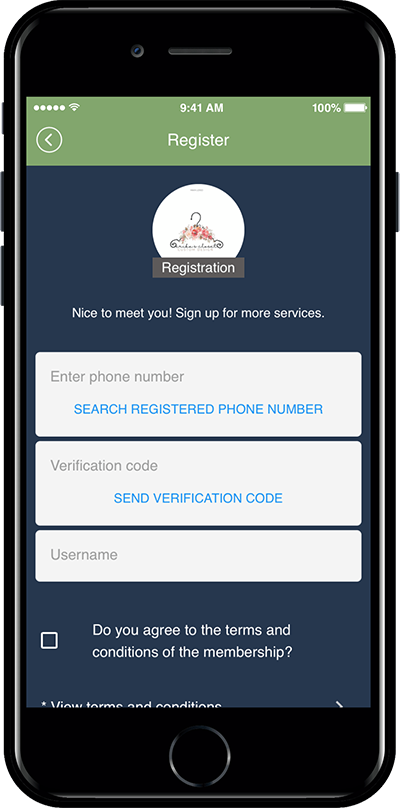
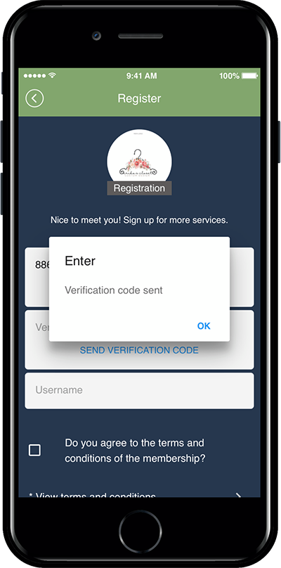
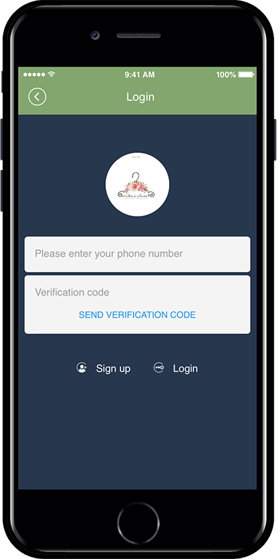

# How to Use 1000 SMS Tickets

**▶ What is 1,000 SMS Tickets?**

This ticket can be used to send phone number verification and text messages to app members. We offer 1,000 SMS for $20. If you need to purchase more SMS, please check the number of purchases you want at checkout.

\
\
**▶Where can I use 1,000 SMS vouchers tickets?**

* Sign Up: Set up your phone number ID
* Send text messages to app members\

\
**▶How do I use it?**

1,000 SMS Tickets on the Swing2App payment page is automatically reflected in the admin page when you purchase products that can be used immediately.

A total of 1,000 SMS tickets are provided.

(\*If you use more, you can check the purchased quantity at checkout and purchase as many as you need).

\-Whenever you send a certification, such as a phone number ID, membership registration, and re-login will be deducted.

\-When you send SMS (text messages), it will be deducted depending on the number of messages sent.

### <mark style="color:blue;">**1. Phone ID Sign Up**</mark>

1. Go to **Manager** and select **Services.**
2. Click **Policy** from the drop-down list. The membership form page will be displayed.
3. Select **Phone no.** to be used during sing up.

> <mark style="color:red;">\*To set Phone number for sign up, user needs to purchase 1000 SMS message package to use</mark>&#x20;

<mark style="color:orange;">**▶How to buy a package/ticket**</mark>

1. Go to **Online Stores** in the **Manager** window and click **Vouchers & Tickets.**
2. Select **1,000 SMS Messages Package** from the list of Packages offered by Swing2App.
3. Please select the quantity and payment mode.&#x20;
4. Click **Buy.**&#x20;

<mark style="color:red;">**★ NOTE!**</mark>

When purchasing a Swing2App paid product as well as an SMS ticket, please go through the product description and other related details mentioned below on the same page of the product while making a purchase.&#x20;

In this way, you can check the policy on how to use the paid products, notices, refunds, and more.&#x20;

<mark style="color:orange;">**▶App launch screen: Verify your phone number when signing up**</mark>

<figure><figcaption></figcaption></figure>

<figure><figcaption></figcaption></figure>

If you set your phone number ID, you will be sent an authentication number after entering the phone number in the sign-up window when you run the app.

If you press Send Verification Number, Swing2App will send you the verification number.&#x20;

Enter the relevant authentication number and complete the registration by entering other membership items.

<mark style="color:orange;">**▶ Phone number verification at re-login**</mark>

<figure><figcaption></figcaption></figure>

Once logged in, the user will remain logged in unless they sign out.

**However, if you log out and then need to log in again, you will need to log in with the authentication number.**

<mark style="color:red;">**★The number of SMSes will be deducted whenever you send a phone number verification required for re-login as well as membership.**</mark>

### <mark style="color:blue;">**2. Send SMS (text message)**</mark>

\*Before sending a text message, please purchase an SMS shipping ticket first!\
\*You must set your membership ID to your phone number.

<mark style="color:orange;">**▶ Send SMS**</mark>

Go to **Manager** and select **Push & Members.** Click **Send Push** from the drop-down list.&#x20;

1. Set **Basic Settings** by selecting a member(s) you want to send SMS.
2. Click **Send SMS** Tab.
3. Fill in an Outgoing number(caller ID).
4. Write the SMS Content you need to send. You can write up to 79 characters.
5. Click **SMS Send**.

\*SMS sending is available with push send.

A text message has been sent to the recipient’s mobile phone.

You can check the caller ID and the text entered.
