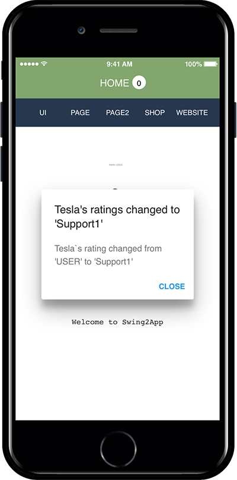
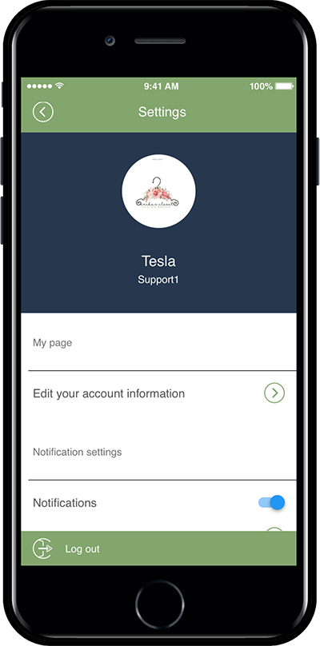

# Permission Group Settings-Membership Rating

**How to create a permission group and apply a rating to members**

Swing2Aapp offers ratings from 1 to 9.

As an administrator, you can create the groups you need for each rating and apply them to your members.

First, create a group by rating in the permission group setting, and then apply the group by selecting members on the member view page.

**Check out the manual to learn how to create groups and apply ratings to members.**

***

### <mark style="color:blue;">**STEP.1 Create a group**</mark>

Go to Manager. Select Push & Members and click Permission Groups from the list.

1. Click on **Create Permission Groups.**
2. Permission groups pop-up will open.
3. Edit the name, ratings, and click **Save.**
4. Click **OK.**

If you select the **Create Permission Group** button on the Permission Group Settings page, you will see a permission group settings window.

<mark style="color:red;">**-3 groups are provided, such as operation (administrator), the user (regular member), and guest. Also, you can create additional groups as required.**</mark>

<mark style="color:red;">**-Since a total of 9 ratings are provided, you can make a group of 9 ratings.**</mark>

<mark style="color:red;">**-You don’t need to use all 9 ratings though. You only need to use the desired rating.**</mark>

**Create the group your administrator wants.**

<mark style="color:blue;">1. Group Class: Select a class.</mark>

<mark style="color:blue;">2. Group Name: Enter a group name to call the class.</mark>

<mark style="color:blue;">3. Group Description: This is not required because it is only visible to administrators. Please describe your group.</mark>

<mark style="color:blue;">4. Press the Save button to complete the group creation.</mark>

> **\*\*Only 1st, 2nd, 3rd and 4th rating are used here.**&#x20;
>
> **Level 1: Excellent Member**
>
> **Level 2: Full Member**
>
> **Level 3: Associate Member**
>
> **Level 4: General Member**
>
> A group has been created like this.

**The group creation is complete.**

You can see all the list of groups you’ve created on the Permission Group settings page.

When you edit or delete a group, you can also work on that page.

***

### <mark style="color:blue;">**STEP.2 Apply Groups to Users**</mark>

<mark style="color:orange;">**\*Once you’ve created a group, you’ll need to apply the group to each user of the app.**</mark>

**1.**

1. Go to **Manager.**&#x20;
2. Select **Push & Members.**
3. Click **Member Views.**&#x20;

**2.** Select the member in which you need to move to another group. Select group from <mark style="color:blue;">**Send Group**</mark>** drop-down** list.

***

1. Select the user (member) to change group
2. Select a group to change from the current group information
3. Select **Change Group** button
4. Select Save member information button

The members’ search page allows you to check all the list of app users who have registered.

From here, you can change the group by selecting the members whose group you want to change.

**3. The group change is complete.**

If you look at the member views page list, you can see that the member who was ‘user’ was changed to ‘Support1’.

<mark style="color:orange;">**Additional Notes: Group Expiration Date Allowed**</mark>

If you specify a group, you can set the group expiration date for that user!!

**\*Expiration Date: You can decide whether to use the group granted to the member for an unlimited period without a time limit or to set an expiration date by setting a period**

The group expiration date is set to ‘unlimited’ by default.

Therefore, if you use it as it is without modifying it, the member will continue to use it as a registered group.

If the administrator sets the group expiration date for the member → On the group expiration date, the group is changed to a general member (user) group.

\*General members are a group of users with a level/grade of 9 that is granted when registering as a member.

\*Group expiration date can be changed by the administrator at any time.

***

### <mark style="color:blue;">**STEP.3 App Launch Screen**</mark>

<mark style="color:orange;">**\*We’ll see how the user level (group) changes in the app.**</mark>

**When a user group changes, a push notification is sent to the user.**

Please select push notifications.

<figure><figcaption></figcaption></figure>

**You can see the message window that the user’s rating has been changed to ‘support1’.**

<figure><figcaption></figcaption></figure>

If you go into the settings menu, you will see the ‘Support1’ ratings on your account.

\*Administrators are free to edit the group to match the performance of their members.

***

<mark style="color:blue;">**How to use the permission group setting**</mark>

Let’s create a permission group and rearrange how to apply the group to users.

<mark style="color:orange;">**STEP.1 Create a group**</mark>

Go to **Manager → Push & Members → Permission Group** Settings menu.

1. When you select the **Create Permission Group button**, you will see a permission group settings window.
2. Group name
3. Enter group description
4. Press the Save button to complete group creation.

<mark style="color:orange;">**STEP.2 Apply Groups to Users**</mark>

**Manager → Push & Member → Member views page.**

1. Select the user (member) to change group
2. Select a group to change from the current group information
3. Select Change Group button
4. Select the Save member information button to complete.

The user will receive a push notification that the group has changed, and the administrator can freely edit the group of members afterward.

<mark style="color:orange;">**★ The permission group settings are used to give different permissions for each bulletin board.**</mark>

Please set the permissions as above.

Please check the manual below to see how far you can use the bulletin board for each group.

**☞** [**Set permissions by Board rating**](../board/create-bulletin-board-by-membership-level.md)
