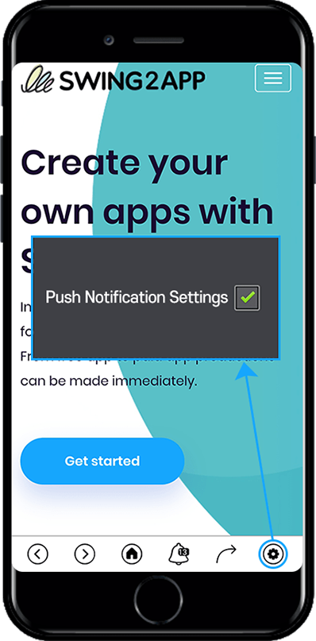

# Push history

**Use Push History**

Push History is a management menu that allows you to check the history of sending push.

You can check and manage information such as push contents, push registration date, shipment status, reservation status, number of sending members, and number of sending devices.

In particular, you can see how many pushers were sent to the actual app users via ‘Sender’, making it easier to manage.

**Check out how to use Push History, including push log history and details.**

***

### <mark style="color:blue;">**1.Push History Menu**</mark>

1. Go to **Manager.**&#x20;
2. Select **Push & Members.**
3. Click **Push History.**

***

### <mark style="color:blue;">**2. Push History**</mark>

On the push history page, you can see the list of pushes sent.

You can check and manage information such as push registration date, shipment status, reservation status, number of sending members, and number of sending devices (push count sent to mobile phone).

<mark style="color:red;">**\*Uniqueness**</mark>

If you look at the push history, you can see that the number of sending members and the number of sending devices are different.

So sometimes you think there is a problem with statistics, but It’s a proof that it’s counting very accurately.

Of course, the numbers may be similar, but if you have a lot of different members and devices, please refer to the information below.

> **1)The number of sending members is 1,000, but only 500 sending devices are counted. Why?**\
> (If you have fewer sending devices than members)\
> \= In this case, you’ve set app users not to receive push notifications.\
> If you choose not to receive push notifications, the number of pushes actually sent to your phone will be counted less than the number of members.\
> If you install the app, sign up, but turn off push notifications, the actual count is also small.
>
> **2)The number of sending members is 500, but the number of sending devices is over 1,000. Why?**\
> (If you have more sending devices than members)\
> \=This is because there are more customers who do not sign up than members who sign up for the app.\
> In other words, guests who do not sign up in Swing2App are not counted as members, and customers are counted as one person.\
> Even if 1,000 users use the app, 500 members who do not sign up will be counted as 501 members.
>
> Therefore, if more pushes are sent to the phone than the number of members, it is because more customers use the app than the registered users.\
> In particular, those who created the app in the push version will be displayed as the number of sending members.\
> The number of sending devices can be checked by the push count sent to the actual mobile phone.

***

### <mark style="color:blue;">**3. Push history – view by content**</mark>

You can filter the push list by selecting the message type, reservation status, status, and more.

Categorize what you want to see in push notifications.

***

### <mark style="color:blue;">**4. Delete push history**</mark>

If you want to delete the sent push record, you can delete it by pressing the **Delete History** button.

***

### <mark style="color:blue;">**5. Edit Push Schedule**</mark>

If you want to edit the contents of the scheduled push, you can select the **Edit your Reservation** button. If you select the **Edit your reservation**, a push window will pop up.

You can re-save your preferences, push content, and more.

***

### <mark style="color:blue;">**6. Cancel Push Repeat**</mark>

If you want to cancel the repeated push, you can cancel the repeat reservation by selecting the **Repeat Cancel** button.

***

### <mark style="color:blue;">**7. What if I want to turn off push notifications in the app?**</mark>

Sometimes you don’t want to get push notifications while using the app. In that case, you can turn off the app push notification.

Prototype when creating an app in Swing2App in a slide, footer, top, drop-down style.

\*After running the app, you can set the push notification settings to \[ON-OFF] in the \[Settings] menu. &#x20;

<mark style="color:orange;">**▶ Apps created with the push version**</mark>

<figure><figcaption></figcaption></figure>

In the Push Prototype app, which is built with push versions, there is a different way to turn off push notifications.

**\*From the toolbar at the bottom of the app screen – select the gear icon – uncheck the push check.**

**If you’re using push, please manage your push shipment history through the Push History menu.**
