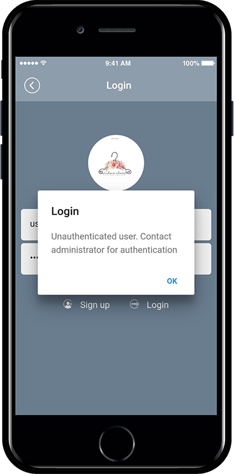
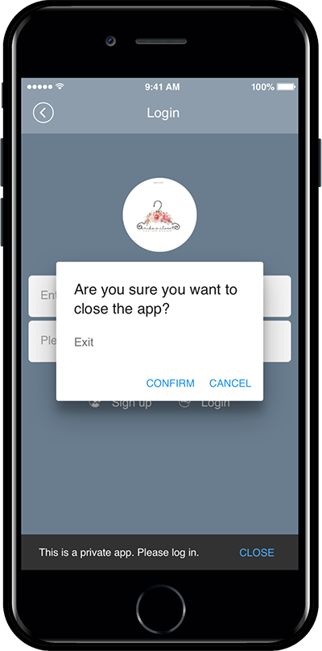

# App Policy Management – App Subscription Policy

App subscription policy manages various policies such as permissions and terms for accessing and using the app.

&#x20;

### <mark style="color:blue;">**Move to App Subscription Policy menu**</mark>

1. Go to **Manager.**
2. Select **Services.**
3. Click on **Subscription Settings.**
4. Click on **Add Subscription Policy.**

### <mark style="color:blue;">**App Subscription Policy page**</mark>

**\*\*App Subscription Policy – You can set the App Privacy, Introduction Message, and Terms of Service policy.**\
\
1\) App visibility: Set the service visibility by selecting Public or Private.\
2\) Sign up text: Write the text visible on the registration page.\
3\) Terms of Service: Enter the Terms of Service & Privacy Policy on the Sign Up page.\
4\) After filling all the contents, press **Save** to reflect the contents in the app.

### <mark style="color:blue;">**1. App Privacy(Visibility)**</mark>

<mark style="color:orange;">**\* App disclosure scope: Set whether membership is required or not to use the app.**</mark>&#x20;

<mark style="color:orange;">**\*We will inform you about the 4 app privacy details.**</mark>

> **1)Public(Guest available): You can use the app without registering and you can use the app’s guest menu.**
>
> **2)Public(Guest available, ID recognition): Using the app without signing up is the same as above, but you can use it after entering the user nickname when running the app.**&#x20;
>
> **3)Private (Available after registration and admin’s approval) : Membership must be required and you can access the app after the administrator’s approval.**
>
> **4)Private (Available when registration): Membership must be the same as above, but you can use the app immediately if you sign up without the administrator’s approval.**

<mark style="color:red;">\*Please set the privacy according to the operating characteristics of the app.</mark>

<mark style="color:red;">The app is produced with the default public release, so if you want to edit it, please go to the Subscription settings page and edit the scope.</mark>

<mark style="color:orange;">**▶App Launch Screen**</mark>

**1)Public (Guests available)**

**2) Public (Guests available, ID recognition)**

**3) Private (Available after registration and admin’s approval)**

<figure><figcaption></figcaption></figure>

<figure><figcaption></figcaption></figure>

<mark style="color:orange;">**▶ Verifying Unauthorized Membership**</mark>

**Admin can verify unauthorized members on the web.**

(1) App operation page Push & Member – Go to the Member inquiry menu.

(2) Select an uncertified member (after checking)

(3) Select ‘Authentication’ in Change Status.

(4) When the authentication status change confirmation message window appears, press ‘OK’ to complete.

**4) Private(Available upon membership registration)**

### <mark style="color:blue;">**2. App Introduction Message**</mark>

The sign-up message can be edited to suit your service.

After editing the message text on the page, press the **Save** button to save it.

<mark style="color:orange;">**▶ App launch screen: Check app subscription text**</mark>

### <mark style="color:blue;">**3. Terms of Service: Terms of Service and Privacy Policy**</mark>

The App terms and privacy policies to be used in the app may also be edited by the user.\
<mark style="color:red;">**We have put the contents in Swing2App for each item.**</mark> \
<mark style="color:red;">**You can use it as it is, but the content will vary from service to service to what apps you offer, so please check and edit it.**</mark>\
After correcting that page, you can click the **\[Setting Policy]** button to save it.\

There are 7 privacy policy items set in the basic comments.

You’ll need to create and put it per the app’s services.

<mark style="color:red;">**\[Important]**</mark>

Mobile applications must now also provide a privacy policy.

**This is the official policy issued by the Korea Internet & Security Agency and the Korea Communications Commission.**

**In case of violation, fines may be imposed under the Information and Communication Network Act.**

You can also check the terms and conditions of service you have written by the URL.

Please select **\[View Terms of Service URL]** at the bottom.&#x20;

As shown in the image above, a new web page window with terms and conditions will appear.

<mark style="color:red;">**TIP. This URL is very important when uploading to the Google Play Store.**</mark>

When uploading the Google Play Store and One Store -You must include the privacy policy URL in the Store Listing.

At this time, users who created the app with Swing2App can copy and paste the URL of the corresponding service terms and conditions.

Therefore, the **Terms of Service do not use the contents of the basic settings in Swing2App, just to fit the service. Please edit it to use.**

(Please note that there may be a problem if you do not edit the app name)

**☞** [**\[Check how to apply the Google Play Store privacy policy\]**](https://support.swing2app.com/knowledgebase/playstore-privacylinks/)

Let’s run the app and see how the Terms of Use and Privacy Policy look.

At the bottom of the registration menu, there is a **View Terms and Conditions** button.

Select the button to see the terms of service you entered in the app subscription policy.
