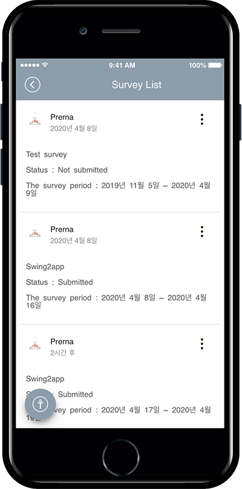

# Surveys

**▶ Create a Survey Form**

1. Click on the **Manager.**
2. Select **Services.** A drop-down list will appear.
3. Click on **Surveys.** The survey form screen will open.
4. Click on **Add Survey.** The Survey screen will appear. Fill in the details like Survey name, time-period, etc.
5. Click on **Add new survey item.** A pop up with survey form will open. Fill in the questions and answers for the survey.
6. Click on **Save.**\\

**▶ How to apply the form in the app?**\
Go to on **Maker(V2).**

1. Click on **Page Menu.**
2. Click on **Add Category.** A new menu item will appear.
3. Select the new menu item and change the name in **Menu Name.**
4. Select the new menu item. Click on the **Link Wizard** icon. The **Link Wizard** pop-up window will open.
5. Click on **Swing Function.**
6. Select a **Survey** from the list. Click on **Reflect**
7. Click on **Apply.**
8. Click on **Save.**

**▶ Survey Participation in the App**\
After running the app, you can participate in the survey.\
You can take a survey by selecting the menu and touching the screen.\
&#xNAN;**\*Surveys are available for members who subscribe to the app-user ratings.**\
**Please note that guests are not allowed.**\
\
\
&#xNAN;**▶ Checking the Survey Results Entered by Users**

1. Click on the **Manager.**
2. Select **Services.** From the drop-down list click on **Survey.** The list of surveys will open.
3. Click on the Participants’ number of the survey you wish to see. The list of participants will open.

### <mark style="color:blue;">**STEP.1 Create a Survey**</mark>

<mark style="color:blue;">**1. Move survey management menu**</mark>

1. Select the **Manager.**
2. Click on **Surveys.** The survey screen will appear.

<mark style="color:blue;">**2. Survey Management – Enter basic information**</mark>

Fill in the mandatory details on the survey page.

1. **Survey name:** Enter the title of the survey.
2. **Set time-period:** Enter the date and time range for the survey.
3. **Survey items:** It contains the list of the question(s) in a survey. You can add a survey questionnaire by clicking on **Add a new survey.**

<mark style="color:red;">**\***</mark> Items marked with <mark style="color:red;">\*</mark> are mandatory.

​**Surveys can be set up as a push.**\
**Select Push Settings, select the destination, and enter a title, content, and image to send a push.**\
**If you need to notify a large audience with announcements, it’s a good idea to use push.**

**​**

<mark style="color:blue;">**3. Enter survey items**</mark>

1. **Questions:** Enter the text or question you need for the survey.
2. **Required items:** If answered is required then please tick the box for the **Required answers** if it’s not required then leave it blank.
3. **Answer type:** It allows users to whether they need Single choice, Multiple choice, or Open-ended answers.
4. Enter the options as per the choice for the survey. Users can add more than one answer by click on **Create an answer.**
5. Once all the details are filled. Click on **Save.**

**​**

**Three Types of Answer Type for Survey**

**1. Single**

**2. Multiple choices**

**3. Open-ended**

**4) Create a single item**: In the case of a questionnaire filling the answer by selecting a view, you can add an item by clicking the **‘Create answer item’** icon.

​**5) Save**: Press to save when all the input is completed.

<mark style="color:blue;">**4. Complete the questionnaire!**</mark>

Once you have completed the details of a survey like Survey name, Time-period, questionnaire, etc., click **Save.**

### <mark style="color:blue;">**STEP.2 Apply Survey Menu to App**</mark>

To apply Surveys, follow the steps below:

Go to **Maker(V2)** and click **Page Menu.**

1. Select the menu item on the Home screen in which you need to enter a new menu item. Then click **Add a Category.**
2. Enter the name of the menu item in **Menu Name.**
3. Select **Swing2App Function** from **Menu Type.**
4. Click the **Link wizard icon.** The link wizard window will open.
5. Select **Survey** from the **Swing Function** list.
6. Click **Reflect.**
7. Click **Apply** and click **Save** at the top of the screen.

To apply **Survey,** please complete the survey form in the **Manager** screen, so that you can apply it to the app you are building and run the actual survey in the app.

### <mark style="color:blue;">**STEP.3 App Launch screen**</mark>

**Once you finish applying it to the app, let’s see how the survey will run in the actual app.**

<figure><figcaption></figcaption></figure>

Before the survey, the status is “Not Submitted”.

Selecting this item will take you to the survey.

<mark style="color:orange;">**▶ Reply to survey items**</mark>

**-Single Choice**

It’s a single-choice item that lets you choose only one answer to your question.

**-Multiple Choice**

This is a multiple-choice question with multiple answers.

**-Descriptive Answer Item**

This is a question that allows the user to enter an answer.

You can respond to surveys by answering these items.

<figure><figcaption></figcaption></figure>

When the survey is complete, the survey results are sent to the administrator.

These sent surveys can be viewed by administrators on the Manage Surveys page shown earlier.

<mark style="color:blue;">**STEP.4 Check Survey Results & Survey Management**</mark>

1. Go to **Manager** screen and select **Services**
2. Select **Surveys.** List of Surveys made by you will open.
3. Search the survey you wish to check the results for.
4. Under the **Participants** row, you will see the number of people who submitted the survey.
5. Click on the **person** and the list of participants will appear under the respective survey. The list will contain all the information about the participant.
6. To check the result of the survey, click on the participants’ information and a pop-up will appear. You can view the response submitted by the participant in the **View Survey Response** screen.

**Note:**

* You can add a new poll in addition to the existing one by selecting the <mark style="color:blue;">**‘Add survey‘**</mark> icon.
* If you click <mark style="color:blue;">**‘CLOSED’**</mark>, you can close the poll before its deadline.
* You can edit the question by selecting the <mark style="color:blue;">**‘EDIT’**</mark> icon and delete it by <mark style="color:blue;">**‘DELETE’.**</mark>

<mark style="color:orange;">**▶You can also share polls**</mark>

You can share the poll on social media and other users to let others know about the survey in progress by clicking on three dots at the top right corner of the survey menu.

Since the survey management function is available to all users of Swing2App, if you follow the manual step by step, you will soon become an app expert.
