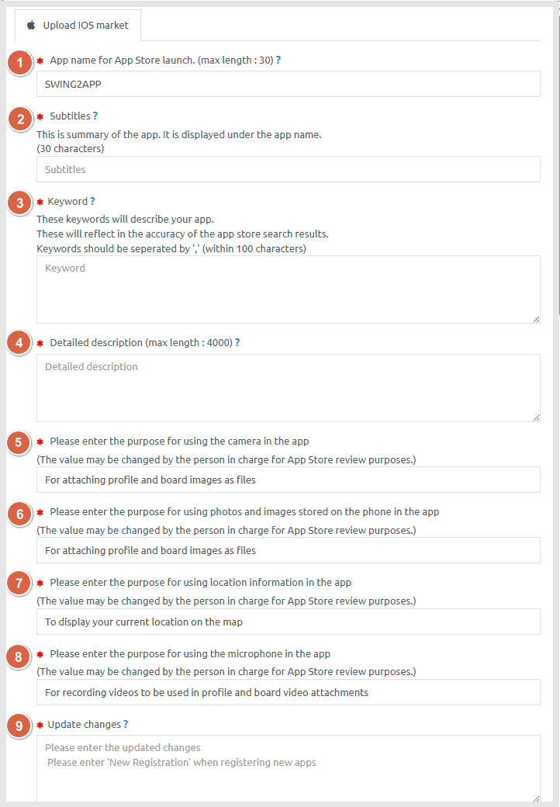
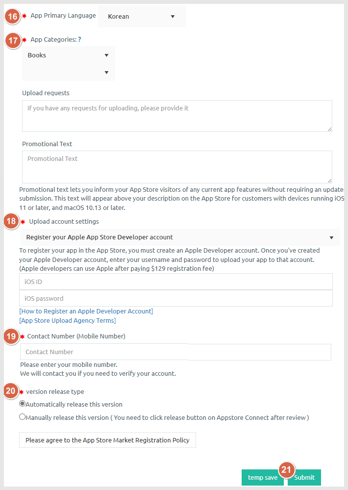
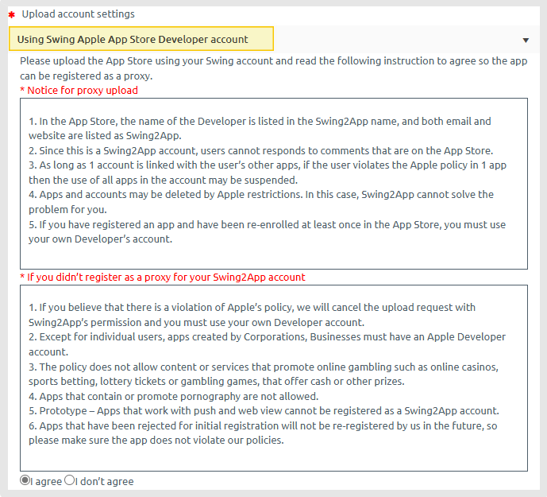
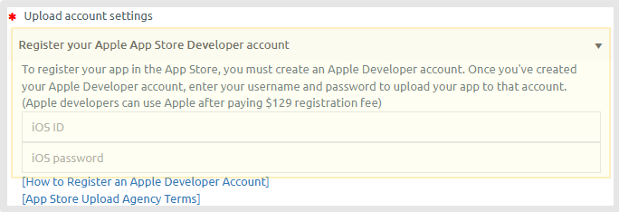

# How to apply for App Store Upload

**How to Apply for App Store Upload**

After creating a swing2app app, if you apply for an app store upload to release a paid version app on the app store, we will upload the app from the agency.

<mark style="color:blue;">**Q. What if I want to post a Swing2App app on the App Store?**</mark>

First, you need to make a paid conversion so that the app can be placed on the market.

**Manager page → Online Stores → Buy Vouchers & Tickets, ticket purchase page, you can purchase the e-store upload ticket with the swing2app paid ticket payment.**

Then the app will go to the market. Think about it!

**Just because you made a payment does not mean that your app will be released to the store.**

**\[App Store upload request] can be registered by the representative in the market after checking the app.**

<mark style="color:blue;">**Q. Where and how do I apply for upload?**</mark>

**The application for uploading is moved to the Swing2App Manager Page → Manage Version → Production History page.**

You can check \[App store upload application] on this page.

​Pressing the corresponding button brings up the application form window.

**Please fill out the ‘Request’ form so that the representative can upload your app to the App Store!**

<mark style="color:blue;">**Q. If I upload, will the app be released to the App Store immediately?**</mark>

We will upload your app to the App Store on behalf of Swing2App.

It will not be released immediately but will be reviewed by Apple.

**App store review takes about 1 week – 2 weeks. \* Please note that Apple has a long review period.**

**Therefore, uploading does not mean that your app will be released immediately.**

**If there are no issues after the review, we will launch to the store normally after the review period.**

However, the release time may be longer because it may be rejected.

<mark style="color:orange;">**★ Please refer to the manual on how to upload Play Store!!**</mark>

**☞** [**\[Go to Play Store Upload Application Method\]**](playstore-upload.md)

**To apply for App Store upload.**

You will need to create the app first, then convert the app to the paid version.

\[Payment-Swing2App Voucher, Ticket Purchase Page] You have to buy paid app vouchers and app store upload tickets!

You can apply to upload an App Store.

In the free version, you can’t purchase an App Store upload ticket and you can’t apply for an upload.

***

## <mark style="color:blue;">**1. How to apply for App Store upload**</mark>

Complete the purchase of the Swing2App paid app voucher and app store upload ticket.

**Move to** [**Manager→ Manage Version → Production History page**](https://www.swing2app.com/view/app_work_history) **and press the \[App Store Upload Request] button.**

***

## <mark style="color:blue;">**2. App Store Upload Application**</mark>

If you press the upload application button on the App Store, the upload application popup window will appear.

Please fill in the contents for each item.

<mark style="color:red;">**\***</mark>\*\* Items marked in <mark style="color:red;">**red**</mark> are\*\* **required.**

Select the <mark style="color:blue;">**question ‘?’ mark icon**</mark> to see the guidelines!

Please check and write how the item appears on the App Store.

## <mark style="color:blue;">**3. App Store Upload Input Guidelines**</mark>

<mark style="background-color:orange;">**The guidelines will explain how to fill out an upload application.**</mark>

<figure><figcaption></figcaption></figure>

1\) App Store Release App Name: Please enter the name of the app to be released on the App Store.

<mark style="color:red;">\*If you write your app name and released app name differently, it will be listed as the release name in the App Store.</mark>

2\) Subtitle: Write a brief app introduction text that appears below the app name. (Less than 30 characters)

3\) Keyword: Enter a keyword to describe the app (100 words or less)

<mark style="color:red;">The search results vary depending on which keyword you enter. Separate them with <,> as in the input guidelines.</mark>

4\) Detailed Description: Write an introduction that describes your app. **\*Please enter as much detail as possible. (If the introduction is not properly done, the review will be rejected)**

5\) Please enter the purpose for using the camera in the app

6\) Please enter the purpose for using photos and images stored on the phone in the app

7\) Please enter the purpose for using location information in the app

8\) Please enter the purpose for using the microphone in the app

9\) Update Changes: **If you update from the existing app to the new version, you can write the changed contents.**

Ex) Change App Name, Change UI Design, Fix App Bug, Change App Design, Change App Icon… and so on.

<mark style="color:red;">**\*If you are applying for your first App Store upload, please write ‘New App Registration’.**</mark>

<figure><figcaption></figcaption></figure>

**10) Support URL: If there is an active homepage, enter the URL**.

Blogs and cafes are also available.

If you do not have a \***website, please put the swing2app homepage URL** [**https://swing2app.com/**](https://swing2app.com/)

11\)**Privacy Policy: Enter the privacy policy URL (link).**

The privacy policy URL is provided by default, but you need to edit the usage policy.

To edit the usage policy such as personal information processing policy, click the <mark style="color:blue;">**\[Change Swing2App Usage Policy]**</mark> button, edit it, and save it.

\*Please copy and paste the privacy policy URL provided by the homepage for the push or web view version of the app.

**12) Screenshot Image**&#x20;

– iPhoneX 6.5 (1242X2688 Pixel Size)

**13) Screenshot Image**&#x20;

– iPhonePro Max 6.7 (1290X2796 Pixel Size)

**14)iPad Compatibility \***<mark style="color:red;">iPad screenshots are optional.</mark>

If you wish to submit the app as compatible with iPad, uploading iPad screenshot images is required.


If you do not provide them, the app will be submitted for iPhone only.

<mark style="color:red;">\*Image registration is not required, so if you do not register, the swing2app team will randomly submit an image.</mark>

<mark style="color:red;">\*Apple submits screenshot images to two versions of the iPhone.</mark>

<mark style="color:red;">\*Also, you can’t put images that aren’t related to the app, you need to capture the app’s launch screen. – Preview the swing2app or capture the virtual machine.</mark>


**15) Enter your login account.**

Please enter a test account that can be logged in from app.
\
For web views and push apps, enter an account that can be logged in from the website you connected to the app.
\
The account is submitted to the App Store review and used to log in with the account to check the app menus. (Please enter an account where you can access all menus)

<figure><figcaption></figcaption></figure>

**16)App Primary Language**

**17) Category**

Determines the category items classified in the App Store.&#x20;

Please select the category that suits your personality.

**18)Upload account settings**

<mark style="color:red;">Please select an App Store upload account.</mark>

\*Apple App Store can be registered on behalf of Swing2App using developer account, or you can create your own Apple Developer account.

\*Please choose one from 2 methods.



**(1)Use a Swing2App Apple App Store developer account**

You do not need to create an Apple Developer account, <mark style="color:blue;">**and your app will be registered with our developer account, Swing2app.co.Ltd.**</mark>

**Please note that you are not able to register as a duplicate with your swing2app account**.

After checking the contents, **please** select the **“Agree to the App Store Registration Policy”** button.

<figure><figcaption></figcaption></figure>

**App store app registration usage policy agreement**

Please be sure to read the App Store Terms of Use by clicking the appropriate button and check **‘I agree’**.



**(2) Register an Apple App Store Developer Account**

-If you are uploading to your Apple account, please create an Apple Developer account first.

– After creating an account at [http://developer.apple.com/](http://developer.apple.com/) Apple Developer Registration site, you should pay the fee of $99 per year.

(Apple Developer account must be registered on the above site. This is nota personal account)

-Register your account and enter your IOS ID and password on the application form.

<figure><figcaption></figcaption></figure>




**19)Contact Number** (Mobile Number)

**​20)version release type**

Automatically release this version

or

Manually release this version

21\) Click the <mark style="color:blue;">**\[Submit]**</mark> button to complete the app store upload request.

***

## <mark style="color:blue;">**4. Upload application completed**</mark>

Please check the upload policy.

We are not responsible for any damage caused by not checking the precautions.


**\*When an app store upload request is received, a representative from the swing2app market upload support team will check and register in the app store.**

App Store review takes about 1 weeks. Please note that the review period is long.

\* If you apply for uploading within the working hours, we will proceed immediately within the same day, but if you apply for uploading outside of the working hours and on weekends, it will not be checked on the same day and will be processed in order during weekdays.

Therefore, please be aware of the content when applying for upload.


***

## <mark style="color:red;">**5. Guide**</mark>

1. App store upload ticket is the agency, **charge to upload the app** on our behalf, **App store upload can be registered only on behalf of the swing2app.** (You can’t upload it yourself)
2. App store review takes about 1 weeks. Please note that the review period is long.\
   So please be patient and wait.\
   \*If you apply for upload outside on weekends and outside business hours, we will not be able to review on the same day, and uploading may be delayed because it will be processed sequentially during weekdays.
3. The App Store is likely to be rejected in the interim because the screening is difficult.\
   If the review is denied, you may be asked for more information, including the reason for the refusal.\
   \*You must reply to our company by email for re-evaluation. If you do not reply within a week, the upload will be suspended. (If you have any pending registration, please contact us again and we will proceed with the review)
4. When the upload is complete, we will send you an email with app store registration and a katok notification talk. (If no number, the only email will be sent)
5. Please check the risks and conditions of proxy registration correctly so that there is no penalty.
6. If you need to upload the updated app to the App Store, you have to repurchase the upload ticket and apply for upload again.
7. During the review process, we will enter the paid app version, so we will not add additional days for the days that were not used during the app review period.
8. Unused tickets are 100% refundable, but tickets are difficult to refund for apps that have already been registered even if they have already been used by the upload application or have been rejected and are not released normally\*\*.\*\*
