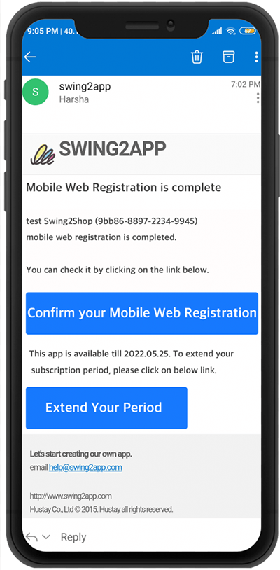
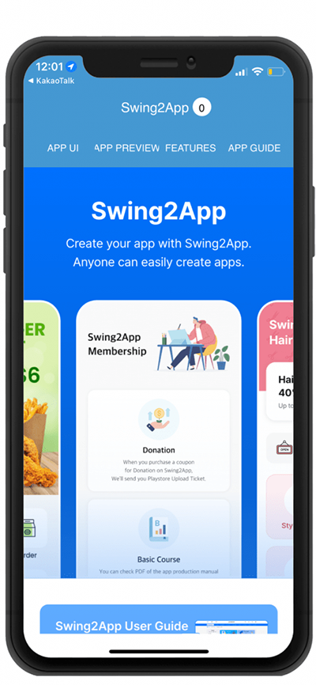

# How to apply for a mobile web upload

**What is mobile web registration?**

Mobile web registration is useful for those who don’t have a website.

It is a service that registers apps created by Swing2App by making them mobile websites.

You can register an app created by Swing2App as a mobile website.

If you purchase a separate domain, purchase a mobile web registration ticket and request to register for a mobile web, we will register the app on that website.

***

> **How to use (apply) for mobile web registration**

App production completed.

→ Purchase a domain to register the site on (purchase separately from a hosting company)

→ Payment for Swing Paid App (Extended or Premium Product), Mobile Web Registration Ticket Payment (20,000 won)&#x20;

→ Fill out the application form by selecting the \[Apply for mobile web upload] button on the  <mark style="color:blue;">App operation-version management-app production history</mark>

→ Launch on the mobile website about 2 days after application.

★ Mobile Web Registration is not available in the free version.

**You can apply for mobile web registration only on the paid version app that has paid for the Swing2App extended or premium paid app pass.**

###  <mark style="color:blue;">**1. Buy Mobile Web Upload Ticket**</mark>

<mark style="color:red;">**\*\* In order to apply for mobile web registration, you must first purchase a paid swing subscription.**</mark>

Please purchase the Swing expandable-type paid app use ticket or premium pass on the <mark style="color:blue;">**※ Swing app operation page → Payment → Swing pass or ticket purchase page.**</mark>

You can apply for mobile web registration only on the paid version app that has paid for the extended and premium paid app.

&#x20;**\*Mobile web applications are only applicable for extended and premium use. (Basic vouchers and affordable package products do not apply.)**

<mark style="color:purple;">-After purchasing the extended pass, please purchase a mobile web registration ticket. \[Mobile web registration ticket 20,000 won]</mark>

<mark style="color:purple;">-The premium pass provides unlimited mobile web registration tickets, so you do not need to purchase a separate mobile web registration ticket.</mark>

<mark style="color:orange;">**★What is the mobile web usage period?**</mark>

If a one-month paid subscription is purchased, the mobile website is also registered for one month.

If you pay for one year, you can also use the mobile website for one year.

***

###  <mark style="color:blue;">**2. Apply for the mobile web registration**</mark>

**When the purchase is complete, go to** [**Version Management → App Creation History page.**](https://www.swing2app.com/view/app\_work\_history)

Please select the \[Mobile Web Upload Application] button in the market registration.

<mark style="color:orange;">**\[Mobile Web Upload Application]**</mark>

When the mobile web upload input window appears, enter the relevant information in order.

1\) Website Name: Enter the website name.

2\) Site Address: Enter the website URL.

3\) Domain Purchase Information: Enter the URL of the site where you purchased the domain.. <mark style="color:red;">\*Please purchase the domain first from sites such as Cafe 24, Godomall, etc.</mark>

4\) Domain purchase information: Enter your domain account ID and password.

5\) Site favicon image: The favicon image is an icon displayed at the top of the Internet browser.

Please check the image size (72\*72) and attach the image.

6\) When the input is complete, finally click \[Apply].

**When the application is complete, a mobile web registration request email is sent to the swing manager.**

**After confirming the person in charge, you can check the registered website about 2 days later.**

***

###  <mark style="color:blue;">**3. Mobile Web Registration Completed**</mark>

<figure><figcaption></figcaption></figure>

When the mobile web registration is completed, a registration completion email is sent to the user’s email address.

Select \[Confirm Mobile Web Registration].

***

###  <mark style="color:blue;">**4. Run the mobile web**</mark>

<figure><figcaption></figcaption></figure>

You can check the registered mobile website.

Your website is assigned to the domain you purchased.

**You can implement your own app to be displayed as a website.**

<mark style="color:red;">**★ Tips for using it**</mark>

1\. The mobile web can be used by those who do not have a website or website.

2\. The App Store review is very long (2 weeks), so if iPhone users cannot use the app, they can use the mobile web instead.

3\. If it is rejected in the App Store review, iPhone users can use the mobile web as an alternative.

4\. If you need a mobile website and the production cost is burdensome, you can use it with the app!

***

<mark style="color:red;">**\[Precautions for Mobile Web Registration]**</mark>\
\

**1) Before applying for mobile web registration, you must purchase a domain that can be linked with the site separately. (Cafe 24, etc.)**

After purchasing a mobile web registration ticket, apply for mobile web registration and we will register the app site with the domain.

**2) Mobile web is available only when a paid app is applied.**

You can’t use it in the free and commercial version, <mark style="color:purple;">**You can apply only when you purchase a swing expendable and premium pass.**</mark>

**3) The mobile web usage period is the same as the paid app usage period.**

Because the app is linked to the web as it is, the mobile web also ends in the same way when the paid app usage period ends.

\*If the period of using the paid app is 1 month, the mobile web is also available for 1 month, and the mobile web is automatically extended when re-paying for the paid app subscription.

**4) Users who have applied for and are using the free commercial version cannot apply. \*Available only for paid apps**

**5) It is not compatible with PC because it is a mobile web.**

The website will also open on PC, but not suitable for PC as the screen resolution is made for mobile.

**6) Even if the app is updated, it is not reflected in the mobile web.**

If you need to change the web with the updated content, please purchase a mobile web upload ticket and apply for the newly updated version.

**7) When registering on the mobile web, it is not searchable on the portal site.**

You must apply separately for the search service provided by the portal site.

Swing2App only performs mobile web registration/ does not perform service registration such as search service and keyword exposure.
