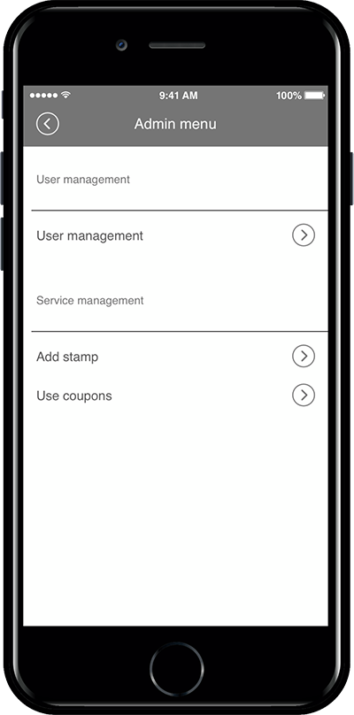

# How to use the App Administrator menu

**\[What is app administrator menu?]**

The App Administrator menu is a service that links the most frequently used functions of the admin menu that had to be operated on the Swing2App homepage into the app.\
For example, in the past, users could chat with administrators in the app when chatting 1:1, but administrators were only available on the Swing2App homepage.\
In addition, functions such as user permission changes and member information notes are not available in the app, but only on the Swing2App homepage.

**However, all of the above features are now available in the app.**\
**We’ve also added the \[Admin menu] to the app.**\
**The frequently used admin menu is available in the app.**\
**We’ll tell you how to use the App Administrator menu and the features provided.**

### <mark style="color:blue;">**1. How to use the App Administrator Menu**</mark>

<figure><figcaption></figcaption></figure>

**After launching the app, \[Settings]> \[Administrator Login]> \[Log in with Swing2App Account]> Administrator menu will be created.**\
&#xNAN;**\*In the previous versions of the app, the Admin login menu is not visible in the Settings menu. (Apps created before September 22, 2017 must be re-created)**\
Therefore, please re-create the app and check the new version.\
Apps created after the update will automatically have an admin login menu in the Settings menu.

### <mark style="color:blue;">**2. Functions provided by the administrator menu**</mark>

**1) User Management**

**User management can check the list of all users subscribed to the app, and select each user to use the menu below.**

1. Chat : 1: 1 chat is available in real-time. Users can push the administrator when they talk to the administrator and immediately have a conversation in the app. (Same features as katok)
2. Change permissions: You can change the user’s permissions in the app.
3. Send push: The app can send a push of a message concept to a specific user.
4. Fixed Member Notes: You can enter member information in the app.

**2) Registering a Stamp**

Since the QR code scanner is built in the Admin menu, you can add a stamp by scanning the QR code of your stamp.

**3) Processing coupons**

The coupon can be used by entering the coupon number sent to the user in the admin menu.

Please check how to use the coupon in the list posted below!

**→**[ **\[**](https://support.swing2app.com/documentation/appmanage/service/coupon/)[**App Administrator menu: See the post on how to use the coupon\]**](../appmanage/service/coupon.md)

### <mark style="color:blue;">**3. Instructions**</mark>

1. If you want to leave the admin menu, please log out from the app.
2. In the previous version, the administrator login menu is not displayed. Please update the app to the new version.
3. Except for the \[Add a Stamp with QR Code] function among the functions provided in the App Manager menu, all functions are available equally on the swing2app site (homepage).\
   -Scanning of QR code is only available in the app because you need to use the app’s built-in reader.\
   -When adding a stamp on the site, please enter the stamp number to use.
4. We will add a manual through the blog on how to use the App Administrator menu.
