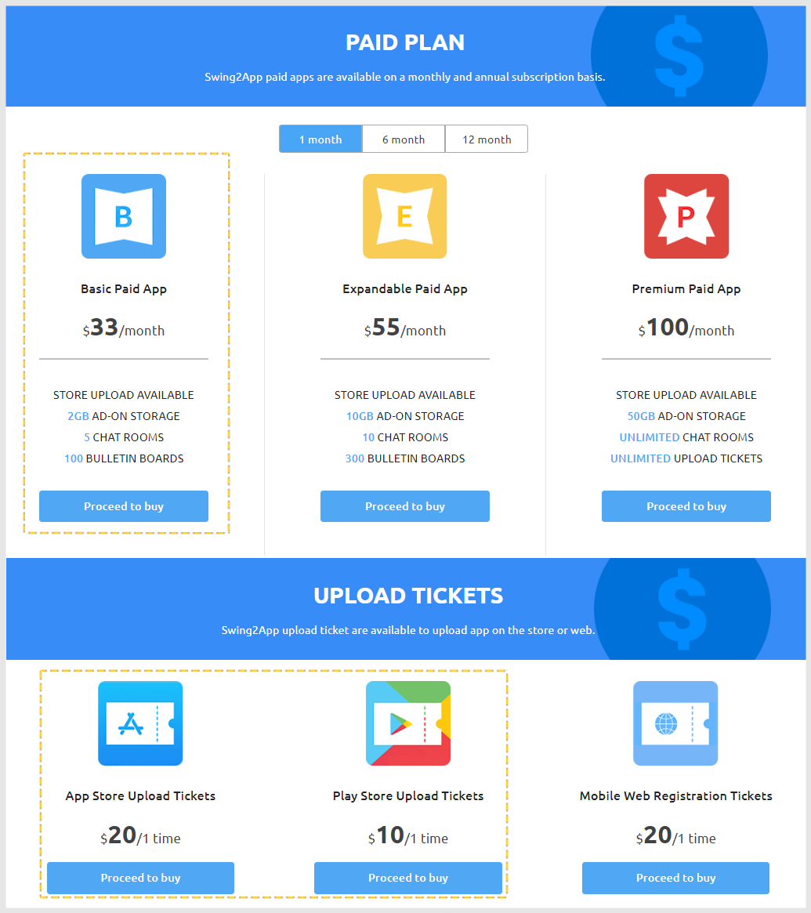

# How to convert and use paid apps.

How to switch and use swing2app paid apps (paid version)

<mark style="color:purple;">\*Free version app: Use for personal use \*but the store cannot be distributed</mark>

<mark style="color:purple;">\*Paid version app: Store distribution (PlayStore, App Store, OneStore can all be released)</mark>

For free, paid, and free commercial use according to the purpose of operating the Swing2App app, you can check the helper manual below for more details.

**☞** [**See How to use Swing2App**](https://support.swing2app.com/swinguse/)

If you wish to launch the store, you will need to use the paid app and purchase a subscription and store an upload ticket.

Please check the manual below to find out how to use the paid app!

***

Check out the manuals and tips for creating the app.

**☞** [**Check the process of app creation**](../maual/appbasic/app-manual.md)

After production is complete, you can switch to the paid app.

All of the Swing2App apps can be made free of charge, and there is no limit to using all functions with the free version app until the store is distributed.

**Therefore, if you do not have any problems after fully testing with the free version app, you can purchase a paid app pass and switch to the paid version.**

<mark style="color:red;">The usage period for all non-limited items is fixed.</mark>

<mark style="color:red;">\*Because the date of use starts counting immediately after purchase, be sure to purchase it when proceeding with the store upload.</mark>

<figure><figcaption></figcaption></figure>

### <mark style="color:blue;">**STEP.1 Purchase of the pass and upload ticket**</mark>

<figure><figcaption></figcaption></figure>

[**Manager → Online Store → Swing paid app plan**](https://www.swing2app.com/view/new\_product\_list\_by\_use\_term)

Please select a paid app pass and purchase a store upload ticket as well.

<mark style="color:red;">**Tip:**</mark> Vouchers range from Basic, Expandable, Premium, and more.

Depending on the product, you need to check the services and functions offered for each product!

When you click the Buy button, you can check the details of the services and instructions provided by the voucher. Therefore, be sure to check your product before you buy it.

If you are unsure of the contents, please leave the inquiry board. We’ll help you with more details.

<mark style="color:orange;">**▶ Package deals**</mark>

In addition to regular tickets, you can also check out the various packages offered by the Swing2App.

Please check the products that fit your app.

Packages are much cheaper for the duration of use than to purchase a regular subscription.

<mark style="color:purple;">**So if you’re thinking of using the app for the long term, rather than monthly, please check the package slot and purchase it.**</mark>

***

### <mark style="color:blue;">**STEP.2 Store upload request**</mark>

If you have purchased both the pass and upload ticket above, please go to the **Manager → Manage Version → Production History** page, and proceed with the upload request.

[**https://swing2app.com/view/app\_work\_history**](https://swing2app.com/view/app\_work\_history)

If you click the **Play Store Upload Application** or **App Store Upload Application** button, an application window will appear.

You must enter the app information you want to release in the store and click the Apply button to submit your application as a Swing2App.

<mark style="color:orange;">\* After purchasing an upload ticket, you must proceed with the application as described above. Once you pay, the application is not accepted!</mark>

**☞** [**\[How to apply for Play Store upload\]**](../appmanage/version/playstore-upload.md)

**☞** [**\[How to Apply for App Store Upload\]**](../appmanage/version/appstore-upload.md)

***

### <mark style="color:blue;">**STEP.3 Complete the upload application, upload the contact in charge**</mark>

Once the application is completed, the PlayStore upload representative of Swing2App‘s store upload representative will start uploading the user’s app to the Store.

<mark style="color:purple;">\*Play Store review period: 7 days</mark>

<mark style="color:purple;">\*App Store review period: 7 days</mark>

Due to the length of the screening time for each store, you will need to wait for the review period after you apply for the upload.

\-When you start uploading, we’ll send you a policy and important announcement email for each store.

\-After a normal release, a ready-to-release email and text (if the user number is registered) will be sent.

\-If the examination is refused, the reason for refusal and action will be announced, and the retrial will be made without the additional cost of the upload ticket.

***

### <mark style="color:blue;">**STEP.4 Store launch completion (release after review)**</mark>

Once the store is launched, you’ll be able to see apps released from the PlayStore and App Store

The App Store is exposed when you search for your app name immediately after the app is launched.

The PlayStore doesn’t immediately search for names when the app is released.

\*Google checks how active the app is to prevent indiscriminate launches and then turns it into exposure.

Therefore, you’ll have to install a lot of apps, manage reviews, ratings, etc., so that you’ll be exposed to app name search over time.

You’ll need to check the store policy so you don’t have to worry about using the app later.

Must-have! Please check.

**☞** [**Check store terms and conditions**](https://documentation.swing2app.com/store-policy)

***

### <mark style="color:blue;">**Frequently Asked Questions**</mark>

**Q. How can I manage and operate the app when using the paid app? (What is different from the free version?)**

Use of paid apps is the same as free apps.

There is no change in the operation method by switching to a paid app, so you can manage the app creation and app operation pages of the Swing to App site.

**Q. I updated the app, do I need to update the store again?**

Yes, if you updated the app, you must update the new version of the app to the Play Store/App Store, etc.

At this time, you need to re-apply by repurchasing the store upload ticket that needs updating.

Do you know that the app menu and content modifications are automatically reflected once saved?

When re-creating (updating) the app – it is only necessary when changing the app name, icon/standby screen, and design theme!!

**Q. If you release the Play Store directly, do you need to purchase only the pass and not the \[Play Store Upload Ticket]?**

Yes, just purchase the pass and switch to the paid version of the app.

You can register directly to the Google Play Store console without purchasing an upload ticket.

Please see the posting below for how to register the Play Store app.

**☞** [**\[To see how to register (release) the Play Store app\]**](https://documentation.swing2app.com/store/playstore/update-playstore)

**Q. Is the user unable to upload the App Store? Is it just acting?**

Yes, the App Store requires development knowledge and is only accessible to developers because it requires code used in the app.

Therefore, the App Store cannot be released directly by the user and must be released only through the agency.

**Q. I bought a pass and uploaded the app to the Play Store, but I get a debug error message.**

The debug message is the message that appears when you upload the free version app.

Normally, when you purchase a pass, the app automatically switches to the paid version. So, just upload the app to the Play Store.

Occasionally, an app may have been created a long time ago, or there may be a case where it is not possible to recognize the usage right due to a time difference.

At this time, please re-produce the app only with the new version by pressing the \[App Production Request] button on the app production page.

If you create a new version, the app is converted to a paid version, so you can register without problems from that version.

**Q. What happens if the period of use expires while using the paid app?**

If you do not pay again after the paid app period expires, the use of the app will be suspended.

<mark style="color:red;">Apps released to the Store will not be deleted or deleted.</mark>

<mark style="color:red;">However, when the app is initially launched, the message’The expiration date has expired’ appears and the app is stopped and terminated.</mark>

Refer to the image) \*App run screen after the expiration date

**Users who have previously downloaded the app from the market are also restricted from using the app as the corresponding message appears.**

If you pay again, the message does not appear and you can use the app again normally.

If you want to use the app again for free, delete the app installed on your mobile phone after the end of the period and re-create the app as a new version.

Since the paid period expires, the corresponding version is a free version.

You can use it as a free app.

Store distribution is not possible because it is converted to a free app.

**Q. When will the number of days of use for paid app passes be counted?**

Paid app vouchers are counted from the day the payment was made.

For example, if payment is made on March 4, the usage period starts on the 4th.

Therefore, if you need to upload an app to the market, please purchase a paid pass and an upload ticket after app creation is complete.
