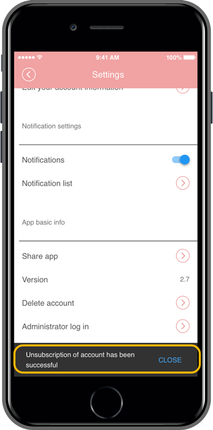
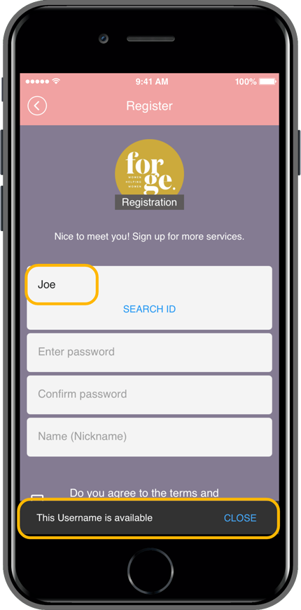
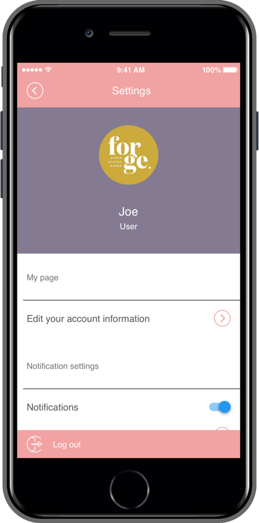

# How to re-register with the same ID after leaving the app

**How to re-register with the same ID after withdrawing from the app membership**

Q. If a user who has withdrawn from the app wants to re-register with the same ID, is there any way to re-register?

<mark style="color:orange;">If you withdraw from the app, you cannot re-register with the same ID.</mark>

However, if the user wants to re-register with the same ID, the administrator can take action on the web dashboard.

<mark style="color:orange;">**If you delete the member who has withdrawn from member inquiry, all information will be lost, so you can sign up again with the same ID.**</mark>

I’ll tell you how to re-enroll a user who has withdrawn from membership through the manual!

 (1) (1).PNG>)

### <mark style="color:blue;">**1. Leave the app membership**</mark>

First, I’ll try to withdraw the membership that was signed up with the test17 ID in the app.

For membership withdrawal, there is a’Membership withdrawal’ menu in the app settings.

You can unsubscribe by selecting the corresponding menu.

Withdrawal is complete.

If you try to re-register with the same ID again, as you can see on the screen, a message saying “ID exists” will appear and you will not be able to register again with the same ID.

 (1) (1).PNG>)

### <mark style="color:blue;">**2. Member Views: Deleting a member**</mark>

Next, the administrator will tell you how to delete the member from the member inquiry page of the web dashboard.

Manager → Push & Member → Go to the Member Views page.

1\)Select the user who has withdrawn from the member inquiry list..

In the “Account withdrawal and deletion” menu in the member information window, select the

2\) Delete member button.

3\)Select the “Delete the ID and all information” confirmation button.

\*Even if the user withdrew, the information remains in the app data, so they will not be able to sign up with the same ID.

Therefore, if you need to re-register with the same ID, you must delete the member ID and all information from the app through member deletion.

 (1) (1).PNG>)

### <mark style="color:blue;">**3. Re-register the app with the same ID**</mark>

After the administrator completes the member deletion, the withdrawn user will access the app again and sign up.

When signing up with the same ID that you withdrew from the membership registration screen, a “This ID is available” message appears.

<mark style="color:orange;">**▶Re-registration complete!**</mark>

You can see that the same (test17) re-registration is possible.

<mark style="color:red;">**\*Information**</mark>

1.When withdrawing membership, the same ID is basically set so that re-registration is impossible.

Please use the above method only when there is an unavoidable request from the user.

2\. When deleting a member, not only the member ID, but also all information such as posts and comments created by the member are deleted.

3\. Since member deletion cannot be restored again, please select the member to be deleted correctly before proceeding.
