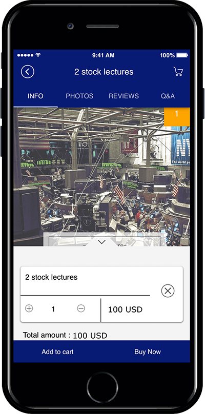
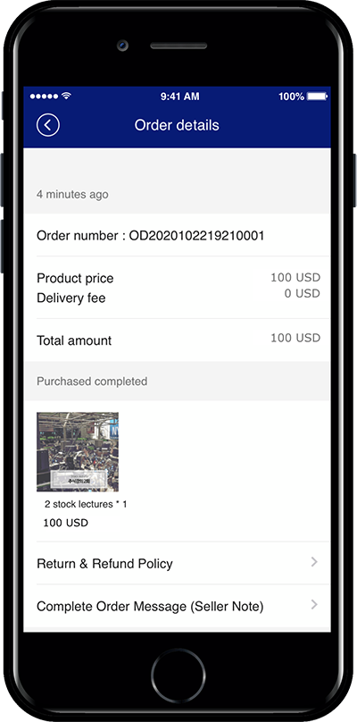
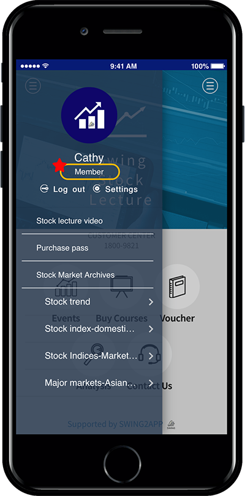

# Product Management-Digital Products: Authorized Sales

Registering swing store products – How to register \[permissions] from digital products

\*For digital sales products-you can select the permission change, PDF, video and file, coupon type.

**We’ll show you how to register your permissions, how to sell them, how to launch your app, and how to use these products.**

<mark style="color:orange;">**What is a digital product ‘permission change’?**</mark>

It is a type of shopping mall that allows users to view the contents by purchasing the rating provided by the app.

For example, VIP customers, premium customers, and top customers are divided into ratings to create products for each level.

Apply content that can be viewed by each grade!

**\*When purchasing VIP permission ☞ All bulletin boards can be read**

**\*When purchasing a premium right ☞ General bulletin boards can be read except VIP board**

**\*When purchasing the right authority ☞ Only the basic information board can be read**

***

<mark style="color:red;">**★ In order to sell rights in the swing store, 2 things must be done first.**</mark>

**1. Set app permissions**

Get a permission first before sale. Should I set a rating on what permissions the app has?

Master permission to view all posts in the app, ratings below that only allow specific bulletin boards… . You must first create a permission level for your apps.

**2. Setting the bulletin board permissions**

Once permissions have been created, you’ll need to set permissions on the bulletin board.

A bulletin board can be viewed by all levels, B bulletin board is visible only to members of the first level, C bulletin board is visible to members 1 to 3 grade, etc ..  Each bulletin board should be rated to access the bulletin board.

***

### <mark style="color:blue;">**STEP.1 Create permission groups**</mark>

<mark style="color:orange;">**First, let’s create a permission to sell (group)!**</mark>

**Move to the swing2app operation page → push & member menu → \[Permission group setting] menu.**

Select **\[Create Permission Group]** button and set up a group.

1\) Select group rating.

\*Groups can be made up to a total of 9 grades. (Excluding operating status, guest ratings)

2\)Enter the group name.

\*Enter the group name to use in the group. and enter the group description (it is only seen by the administrator, and not the general user)

3\) Click Save

4\)Press the OK button to complete it.

New permission group created. (Permission can be edited and deleted additionally)

### <mark style="color:blue;">**STEP.2 Managing bulletin boards – Setting Permissions**</mark>

Go to Service Management – Bulletin Board Management and select the **\[Create Board]** button.

Create a bulletin board you want, but you just need to enter the **details** at the bottom.

**=Apply the permissions you created prior to the writing permissions, view detail permission, and list permission.**

And <mark style="color:red;">★ Please check the ‘Use’ in</mark> <mark style="color:red;"></mark><mark style="color:red;">**\[Allow permission to use the specified function]**</mark><mark style="color:red;">.</mark>

**The designated authority is a function that only the authority can access the bulletin board.**

**If you want to use all 1st – 3rd ratings, check ‘Disable’ for the designated authority.**

This is the first thing you need to do to sell your rights.

From now on, we will create a category in the swing store menu and register the privilege product.

***

### <mark style="color:blue;">**STEP.3 Product Category Registration after Swing Store Application**</mark>

Please apply for a swing store first. The swing store must be requested before the menu is available!

**☞**[ **How to apply for Swing Store**](../aff-program/apply.md)

You must apply for a swing store to create a \[Swing Store] menu at the top of the app operation page.

If you created a \[Swing Store], you must first register your product category.

<mark style="color:red;">**\*Rather than registering a product, you must first create a category that contains the top menu which includes the product!**</mark>

**Move to Swing Store → Product Management → Product Category Registration Management menu..**

Select 1) \[Register] button on product category registration management screen.

In the category management window, 2) Category name 2) Representative image 3) Category description 5) Priority 6) Check display status 7) Select save button.

<mark style="color:red;">**\*Priority is placed at the top as the number is higher, and if the priority is the same, the first registered category will be placed at the top, depending on the item registration date.**</mark>

<mark style="color:red;">**\*Categories must include a name that includes the product. Example) top, bottoms, accessories… Like this.**</mark>

Category registration is complete.

Categories can still be added from that menu without limiting the number of categories.

You can edit the content by selecting the category, and delete the category with the \[Delete] button.

***

### <mark style="color:blue;">**STEP.4 Digital Registration**</mark>

<mark style="color:orange;">**Let’s apply and register ‘Change Permissions’ among digital products once the category registration is over.**</mark>

Move to Swing Store → Product Management → Product Registration Screen.

1\. Product type: Select ‘Digital’.

2\. Select your digital product type: Select <mark style="color:blue;">\[Change permissions, view PDF, videos and files sales, coupon]</mark>.

<mark style="color:red;">**In this post, you’ll be registered by selecting ‘Change permissions’!**</mark>

3\. Permission Registration: We’ve created a permission rating above. Please select the permissions you need.

4\. Permission period: Enter the period during which permissions are maintained.

<mark style="color:red;">-If there is no time limit, check ‘Unlimited’ and select.</mark>

<mark style="color:red;">-If you have a time limit, please enter it on a daily basis.</mark>

<mark style="color:red;">**Example) 3 unlimited drinks coupons for $10! => Can be used for these events.**</mark>

5\. Product Name: Enter a product name.

6\. Product Representative Image: Register the representative image shown on the product purchase page.

7\. Registration status: Select from Available for sale, Out of stock, Suspension of sale, taemporary registration status.

8\. Product price: Enter the price to sell.

9\. Batch order: List the order in which the goods are displayed in the corresponding category. <mark style="color:red;">\*The higher the order, the lower it is placed on it, and the lower it goes down.</mark>

10\. Product Category: Select the product category.

<mark style="color:red;">**\*As mentioned above, you must create a product category first so that you can select a category in the product registration! Don’t forget to create a category first.**</mark>

11\. Payment method by product: Please check PAY APP (Pay App) card payment.

<mark style="color:red;">\*Digital products cannot be used as non-bank accounts and electronic payment modules must be applied.</mark>

12: Offer a discount: Select whether to display the products at the original price or to apply the discount.

<mark style="color:red;">**\*If you check the discount as “Yes”, you will see an option window that sets the discount amount and period.**</mark>

<mark style="color:red;">**\*The discount amount must be entered in the final discounted amount.**</mark>

13\. Use inventory management: Check whether you want to use product inventory management. / If you check the quantity, please enter the quantity to sell.

14\. Availability: You can use it if you add an optional item to your product.

Digital products did not set options separately. If you set the option, please check the gif image below!

**Examples) You can set options and the amount of options by adding sizes, adding colors, and more.**

<mark style="color:orange;">**▶For more options, check out the image below!**</mark>

15\. Product Brief Description: Enter a simple one-line description to introduce the product.

16\. Product Description: Please write details such as product image, description, product information, refund and exchange using the editor program.

17\. Product detailed image: Register the product image. Multiple images can be registered and can be reordered.

18\. Order form items: If you have any information you need to receive, please fill out the order form.

19\. Ordered Message: If you don’t have a specific message, you can skip.

20\. Click the \[Save] button to complete the registration of the product.

**—Product registration is complete. You can check the registered product in the product inquiry.—**

You can check the list of registered products in the product search menu.

If you need to modify the contents of the registered product, select the product you want to modify with the mouse.

Go to the product registration modification screen.

### <mark style="color:blue;">**STEP.5 Applying Category to App**</mark>

Once you’ve registered your digital product above, we’ll apply a page in the app where you can purchase the actual products.

**▶ Applying product categories**

Please go to the Maker(V2) page.

1. Move to the page menu step of the app production step. Click the **Add New Category** button on the Main Menu to add the menu.\

2. Enter a name in the menu you created.\

3. Select the **Product Category** in the **menu type.**\

4. Click on **Link Wizard** and add enter the web link address (URL).\

5. Search for the product category you want to assign.
6. Select **Reflect.**\

7. Select the **Apply** button.
8. Press the **Save** button.

<mark style="color:blue;">**\[App Launch Screen]**</mark>

Product category is the style in which the category is configured in the menu.

**When you apply the “Buy ratings” category to your app, you’ll see a list of categories and see which products are listed in that category.**

So it can be applied when you want to show your products by category.

Go to the purchase page when selecting a product.

***

### <mark style="color:blue;">**STEP.6 Swing Stock Sample App) Confirm the purchase of permission change**</mark>

Please check how the change of permissions product is registered in the app through Swing2App Stock sample app.

You can also view how to purchase and use permission changes through the sample app.&#x20;

<figure><figcaption></figcaption></figure>

<figure><figcaption></figcaption></figure>

Master authorization purchase is complete.

<figure><figcaption></figcaption></figure>

At the same time the purchase is completed, the permission will be changed to ‘Master’.

**\*Let’s check how the permission change affects the use of the app and how to use the master permission.**

<mark style="color:orange;">**\[Before purchasing permissions]**</mark>

If you access the \[Stock Index-Domestic Stock Index] bulletin board with a general membership level before purchasing permission, a message window appears saying that you do not have the authority.

<mark style="color:orange;">**\[Access after master rights purchase is completed]**</mark>

After purchasing permissions as a master, you can access the bulletin board again to see all the details of the bulletin board.
