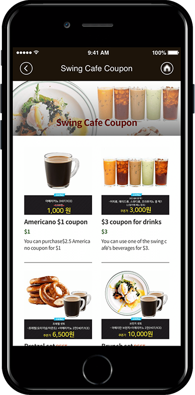
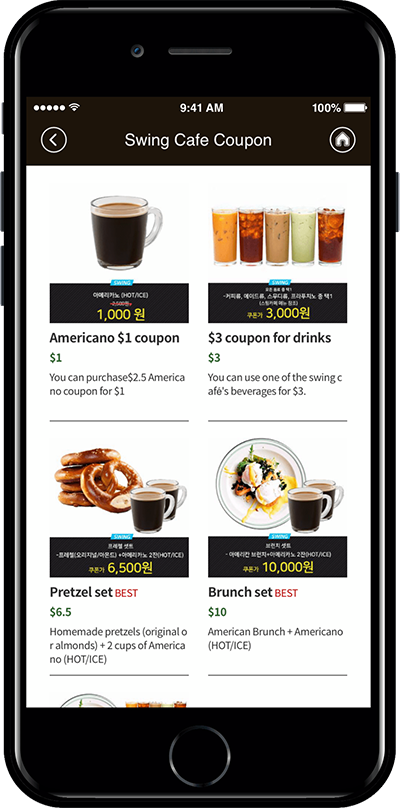

# Product Management-Digital Products: Coupon Registration

How to register a coupon for a swing store digital products.

Swing Store is a shopping mall service provided by the app-maker Swing2App.

Swing Store can be registered by selecting a variety of product types – Original Products, reservations products, digital products, etc.

Digital products are the type of product that sells intangible content. You can register \[Change permissions, view PDF, Videos and files sales, coupons].

You can sell coupons to users of the swing store digital products by registering the coupon.

**★You can use the coupon shipping function and swing store payment service provided by Swing2App.**

For example, 1 month pt of gym, nail shop gel nail coupon, haircut 30% discount coupon, etc.&#x20;

You can create these coupons, apply them to the Swing Store feature app, and purchase the coupons you want. &#x20;

**\*Existing swing2app coupon issuing service and + swing store coupons made by combining  the way to the actual purchase.**

We’ll show you how to register your offer in the swing store and apply it to the app.

Please check the digital product – How to register a coupon and how to apply the app through the manual.

***

### <mark style="color:blue;">**STEP.1 Create Coupon**</mark>

<mark style="color:orange;">**Unlike other swing store products registration, when you sell a coupon, you’ll need to register it on the coupon management page.**</mark>

Move to Swing2App Manager Page → Services → Coupons menu.

On Coupons screen, click **Add Coupons.** A Coupon information window will open and enter the information.

1. Enter Coupon name.
2. Enter Coupon content.
3. Select the validity of the coupon either by selecting the date and time or checking Unlimited.
4. Upload image for the coupon.
5. Select **Save.**

**\*\*Coupons can be added by pressing the \[Add Coupons] button. You can see the coupons created in the list.**

**Coupon registration is complete!!**

**On the right side of the coupon created there is a management function, so you can edit or delete the coupon..**

**After the coupons are made, go to the Swing Store menu and register a coupon to sell!**

***

&#x20;

### <mark style="color:blue;">**STEP.2 Register Swing Store Product Category Registration**</mark>

**Please apply for a swing store first. The swing store must be requested before the menu is available!**

**☞**[ **How to apply for Swing Shop**](../aff-program/apply.md)

You must apply for a swing store to create a \[Swing Store] menu at the top of the app operation page.

If you created a \[Swing Store], you must first register your product category.

<mark style="color:red;">**\*Rather than registering a product, you must first create a category that contains the top menu which includes the product!!**</mark>

**Move to Swing Store → Product Management → Product Category Registration Management menu.**

&#x20;

Select 1) \[Register] button on the product category registration management screen.

In the category management window, 2) Category name 2) Representative image 3) Category description 5) Priority 6) Check display status 7) Select save button.

<mark style="color:red;">**\*Priority is placed at the top as the number is higher, and if the priority is the same, the first registered category will be placed at the top, depending on the item registration date.**</mark>

<mark style="color:red;">**\*Categories must include a name that includes the product. Example) top, bottoms, accessories… Like this.**</mark>

&#x20;

Category registration is complete.

Category registration is complete.

Categories can still be added from that menu without limiting the number of categories.

You can edit the content by selecting the category, and delete the category with the \[Delete] button.

### <mark style="color:blue;">**STEP.3  Select Digital Product \[Coupon]**</mark>

<mark style="color:orange;">**Once the category has been created, we’ll register and apply the coupon among digital products.**</mark>

Go to Swing Store → Product Management → Product Registration screen.

1\. Product Type: Select ‘Digital’.

2\. Digital Product Type: Select from <mark style="color:blue;">\[Change permissions, PDF view, video and file sales, coupon]</mark>. \

**In this manual, you will select and register a ‘coupon’!**

3\. Select Coupon : Select the coupon you want have created.

4\. Coupon quantity: Enter the quantity sold.\

<mark style="color:red;">**– The default quantity is 1. \*One coupon is issued at the time of payment.**</mark>

<mark style="color:red;">**-If you need to issue multiple coupons at the time of purchase, you can enter the desired number in quantity.**</mark>

<mark style="color:red;">**Example) 3 unlimited drink coupons for $10! => Can be used for these events.**</mark>

5\. Product Name: Enter the product name.\

6\. Product Representative Image: Register the representative image shown on the product purchase page.

7\. Registration status: Select Available for sale, out of stock, suspension of sale, temporary registration status.

8\. Product Price: Enter the coupon price.\

9\. Batch order: List the order in which the products are displayed in the category. \*The higher the order, the lower it is placed on it, and the lower it goes down.\

10\. Product Category: Please select the product category.\

<mark style="color:red;">\*As mentioned above, you must create a product category first so that you can select a category in the product registration! Don’t forget to create a category first.</mark>

11\. Payment method by product: Please check PAY APP (pay app) card payment.

<mark style="color:red;">\*Digital products cannot be used as non-bank accounts and electronic payment modules must be applied.</mark>

12: Offer a discount: Select whether you want the product to appear at its original price or you want to apply a discount.

<mark style="color:red;">**\*If you check the discount as “Yes”, you will see an option window that sets the discount amount and period.**</mark>

<mark style="color:red;">**\*The discount amount must be entered in the final discounted amount.**</mark>

13\. Use inventory management: Check whether you want to use product inventory management. / If you check the quantity, please enter the quantity to sell.

14\. Availability: You can use it if you add an optional item to your product.

Digital product did not set options separately. If you have an option, please check the gif image below!!

**Examples: You can set options and the amount of options by adding sizes, adding colors, and more.**

****

**▶ **<mark style="color:orange;">**For more options, check out the image below!**</mark>

15\. Product Brief Description: Enter a simple one-line description to introduce the product.

16\. Product Description: Please write details such as product image, description, product information, refund and exchange using the editor program.

17\. Product detailed image: Register the product image. Multiple images can be registered and can be reordered.

18\. Order form items: If you have any information you need to receive, please fill out the order form.

19\. Ordered Message: If you don’t have a specific message, you can skip.

20\. Click the \[Save] button to complete the product registration.

**—Product has been registered. Registered products can be found in the Product List.—**

You can find a list of all the registered products in the Product Search menu.

If you need to modify the content of the registered product, please select the product you want to modify with your mouse.

Go to the product registration modification screen.

***

### <mark style="color:blue;">**STEP.4 Apply Product Categories to your App**</mark>&#x20;

<mark style="color:orange;">**Once you’ve registered your digital product above, we’ll apply a page in the app where you can purchase the actual products.**</mark>

<mark style="color:orange;">****</mark>

**01. Applying product categories**

Please go to the Maker(V2) page.

1. Move to the page menu step of the app production step. Click the **Add New Category** button on the Main Menu to add the menu.
2. Enter a name in the menu you created.
3. Select the **Product Category** in the **menu type.**
4. Click on **Link Wizard** and add enter the web link address (URL).
5. Search for the product category you want to assign.
6. Select **Reflect.**
7. Select the **Apply** button.
8. Press the **Save** button.

<mark style="color:orange;">**\[App Launch Screen]**</mark>

<figure><figcaption></figcaption></figure>

Product category is the style in which the category is configured in the menu.

**When applying the “Swing Cafe Coupons” category to the app, a list of categories will be displayed and you can see the products listed in that category.**

So it can be applied when you want to show your products by category.

When you select a product, go to the purchase page.

**02. Apply as a template page**

****

<mark style="color:orange;">**\[App Launch Screen]**</mark>

<figure><figcaption></figcaption></figure>

Swing Cafe Sample App created a coupon purchase page by applying the \[Web Template Page].

I’ve entered coupon images, prices, and contents in the template.

When you touch each list, it was applied using the link wizard to go to the product purchase page.

***

### <mark style="color:blue;">**STEP.5  Swing Cafe Sample App) Check your purchase of coupons**</mark>

**Please check how the coupon digital product is registered in the app through the Swing Cafe sample app.**

**You can also find out how to purchase and redeem coupons through the sample app.**

Purchased coupons can be found through coupon confirmation menu.

<mark style="color:red;">**\*Coupon confirmation menu can be applied on the app production page – page menu – swing2app page!**</mark>

Available coupons and used coupons are shown.

<mark style="color:orange;">**★ How to use coupons**</mark>

**How can I process user coupons? You can apply the use of the coupon through the serial number listed on the coupon.**

<mark style="color:orange;">**\*Please check the manual link below to see how the administrator can process the user’s coupon usage!!**</mark>

**▶** [**View how the coupons are issued and used**](../appmanage/service/coupon.md)
