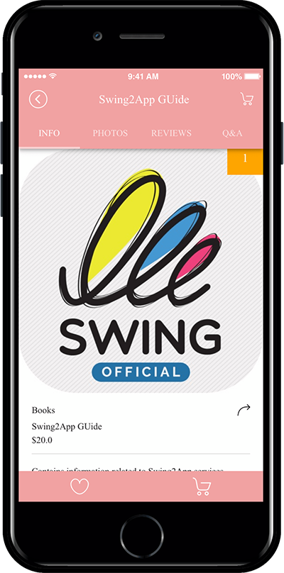
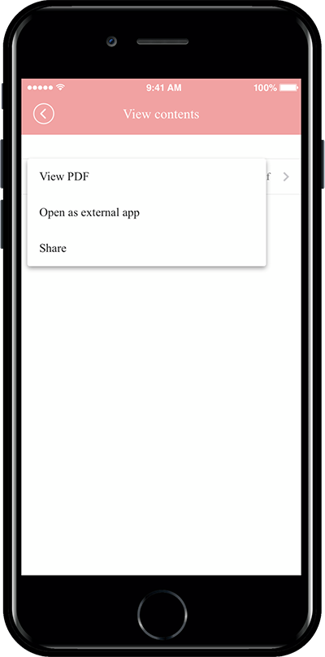

# Product Management - Digital Products: PDF File Registration

**How to register PDF file registration among Swing Store digital products**

\* As a digitally sold product- you can choose to change permissions, PDFs, videos and files, and coupon types.

You can view the document as a PDF file.&#x20;

You can choose how to download PDF files from the Swing Store, the app launch screen, and the product.

### <mark style="color:blue;">**STEP.1 Register a product category after applying for a swing store**</mark>

First, apply for a swing store. Please select the menu available for the Swing store.

**☞** [**View how to apply for a Swing Store**](../aff-program/apply.md)&#x20;

The \[Swing Store] menu has been created at the top of the app operations page, where you must apply for a swing store.

The version in which \[Swing Store] was created, you need to update the product category first.

\* We are registering a product.

**Go to Swing Shop → Products → Product ​​Category Registration Management.**

1\) Select the \[Register] button.

In the Category Management window, select 2) Bulb Name 2) Representative Image 3) Bulb Description 5) Priority 6) Display 7) Save button.

**Priorities will all be the same.**

**\* The menu includes the product. Ex) Of course, bottoms, accessories… Like this.**

Category registration is complete.

Category registration is complete.Categories can continue to add menus without limiting the number.

Choose a selection category to edit the content.

### <mark style="color:blue;">**STEP.2 Register digital products -PDF**</mark>

<mark style="color:orange;">**If you have finished registering the category now, we will register the product.**</mark>

Please go to Play Store → Product Management → Product Registration.

1\. Product type: Select ‘Digital’.

2\. Select Digital Product Type : <mark style="color:blue;">**\[change permissions, PDF view, video and file sales, coupons]**</mark> can be selected.

Select ‘View PDF’ for the post you need.

3\. Pdf file upload: Please upload the pdf file you want to register, you can select the \[Preview] button to see the file you registered.

4\. No external sharing and interlinking.

<mark style="color:red;">**-If you can’t share a purchased PDF file, and you want to set it to check only in the app, please check ‘Do external sharing and linking’.**</mark>

<mark style="color:red;">**-If you don’t mind sharing and interlinking externally, please uncheck it.**</mark>

5\. Product Name: Please enter a product name.

6\. Product representative image: Register the representative image shown on the product purchase page.

7\. Registration status: Available for sale, out of stock, No offer, and temporary registration status can be selected.

8\. Product Price: Enter the price to sell.

9\. Placement Order: Enter the order in which the products are shown in the category.

10\. Product Category: Please select a product category.

<mark style="color:red;">**\*As mentioned above, the product category must be created first so you can select a category in the product registration. Don’t forget to create a category first.**</mark>

\*Digital products cannot be used for deposit, and the electronic payment module must be applied.

12: Offer a discount: Choose whether to display the products at the original price or to apply the discount.

\*If you check the discount as “Yes”, you will see an option window that sets the discount amount and the discount period.

\*Please enter the final discounted amount.

13\. Use inventory management: Check whether you want to use product inventory management.

14\. If you check the quantity, please enter the quantity to sell.

15\. Availability: You can use it if you add an optional item to your product.

Digital products did not set options separately. If you set the option, please check the gif image below.

Example: Clothing Store: You can set the option and set the option amount by adding size, adding color, etc.

▶ <mark style="color:orange;">**For more options, check out the image below!**</mark>

16\. Short Product Description: Enter a short one line description that introduces the product.

17\. Product Details: Please use the editor program to write detailed information such as product image, description, product information, refund and exchange.

18\. Product detailed image: Register the product image. Multiple images can be registered and can be reordered.

19\. Order form items: If you have any information you need to receive, please provide input or fill out the order form.

20\. Ordered Message: If you don’t have a specific message, you don’t need to write it.

21\. If you press the Save button, you will be able to register your reservation system product.

**—Product registration is complete. You can check the registered product in the product inquiry.—**

You can check the list of all registered products in the product search menu.

If you need to edit the registered product, select the product you want to edit with the mouse.

Go to the product registration modification screen.

### <mark style="color:blue;">**STEP.3 Apply product categories to your app**</mark>

<mark style="color:orange;">**If the digital product registration is completed above, we will apply the page where you can purchase the actual product in the app.**</mark>

Please go to the Maker(V2) page.

1. Move to the page menu step of the app production step. Click the **Add New Category** button on the Main Menu to add the menu.\

2. Enter a name in the menu you created.\

3. Select the **Product Category** in the **menu type.**\

4. Click on **Link Wizard** and add enter the web link address (URL).\

5. Search for the product category you want to assign.
6. Select **Reflect.**\

7. Select the **Apply** button.
8. Press the **Save** button.

### <mark style="color:blue;">**STEP.4 App Launch Screen) Digital Product Sales App**</mark>

**Swing2App Academy offers a sample app.**

**And how to buy pdf files, and create a view.**

<figure><figcaption></figcaption></figure>

<figure><figcaption></figcaption></figure>

**★ Swing Store Digital Product: Do want to check the app where the pdf file has been registered ??**

**Please check the swing2app school sample app below.**

**☞**  [**Go to the swing2app school sample app**](https://blog.naver.com/swing2app/220462318083)
