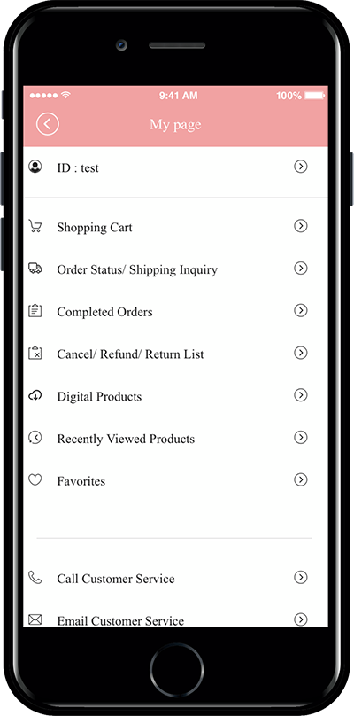

# Introduction of pages provided by Swing Shop

**Introduction of pages provided by Swing Shop**

**Introducing the basic page required when creating a shopping mall app and telling you how to apply the app\~!!**

Since Swing2App can build a shopping mall app, many people apply for and use Swing Shop, a shopping mall function.

One of the most frequently asked questions while building a shopping mall app!

After applying for Swing Shop, I registered the product.

How can I apply the basic pages needed in the shopping mall, such as shopping cart and check my purchase history, to the app?

In this way, they give us a lot of inquiries to create the basic page needed in the shopping mall app.

If you apply for Swing Shop, all pages necessary for the shopping mall are provided by default, so users only need to add a menu and apply only the pages they want to the app. ^^

Please look at the manual and check what pages there are, and we will guide you with the application screen of the app.

***

**Q. Where do I check the Swing Shop page and how do I apply it to the app?**

When you apply for Swing Shop, basic pages that can be operated in the shopping mall are provided.

You can check the page by selecting the Swing2App Maker(V2) page-page menu level-Load Swing Page

**↓**

When you apply for Swing Shop, all shopping mall related pages are provided by default. !!

\*Maker(V2) page – At the page menu level – Menu type: Select \[Swing Page] and then select Import to automatically create pages related to Swing Shop (page required for shopping mall operation).

> **\[Swing Shop Page Guide provided]**
>
> **-Customer (user) page: shopping cart, my page(My Profile)**
>
> **-Shopping mall main(Shop Main Page), shopping mall information(Shop Info)**
>
> **-Category list**
>
> **-Digital product purchase completion page**
>
> **-Date reservation product reservation(Booking), Date+time reservation product reservation(In-out Time)**
>
> **-Product search**

Therefore, if you use Swing Shop, you can check all the menus related to Swing Shop by choosing Swing Page from the app production page.

You can apply the required menu to the app and use it.

Each page is applied to the menu, and if you look at the virtual machine on the right, you can see how the page looks on the app in real time.

So, as you build the app, you can apply several pages to the menu and see how it works through a virtual machine.

I’ll show you the app execution screen for each page through the manual below\~!!

***

<mark style="color:blue;">**1. Shopping Cart**</mark>

<figure><figcaption></figcaption></figure>

Everyone knows the shopping cart without explaining it? ^^

This is a page where you can check the items you have placed in your shopping cart or before purchasing a product.

<mark style="color:blue;">**2. Category list**</mark>

<figure><figcaption></figcaption></figure>

**Category list is a page that shows categories as a list, not individual products.**

When you register a product, you create a category first and then register the product for each category.

Clothing shopping malls, for example.

\-TOP: T-shirts, blouses, knitwear

\-DRESS: One Piece

\-BOTTOM: Pants, skirts, shorts, jeans

After organizing the categories like this, you will register the appropriate products for each category.

Therefore, even the categories that have been created like this can be configured as well.

<mark style="color:blue;">**3.  Digital product purchase completion page**</mark>

This page is available only if you have registered your digital product.\_Page dedicated to digital products

\*Digital products: products such as pdf, video, files, coupons, etc.

You can’t use physical or pre-order products even if you apply the page.

This page is for checking and viewing the contents you purchased.

You need to apply the page to check the contents purchased by the users in the app.

<mark style="color:blue;">**4. My Profile**</mark>

<figure><figcaption></figcaption></figure>

\[My Page] is a page where you can check all the details of your purchase, payment, and delivery.

So on the shopping mall app, make sure!! It’s a function that you have to put in.

As you can see in the image, it provides functions such as order status, delivery inquiry, delivery completion, purchase completion, and exchange inquiry.

<mark style="color:blue;">**5. Shopping Mall Main**</mark>

<figure><figcaption></figcaption></figure>

The shopping mall main page is a main home screen page suitable for applying to the home screen.

We offer it as a shopping mall gateway.

A menu of popular products, categories, and major products is provided.

Because it’s a fixed style, you can’t modify the design separately.

This page does not have to be applied as a home screen, so you can decorate it according to your app style. ^^

<mark style="color:blue;">**6. Shopping Mall Information**</mark>

<figure><figcaption></figcaption></figure>

It’s the store information page.

The page consists of basic shopping mall information and provides customer center and operating hours.

<mark style="color:blue;">**7. Search for a product**</mark>

<figure><figcaption></figcaption></figure>

This is a product search page where you can search for registered products in the app.

You can search for the product name by touching the magnifying glass icon button.

\*Select the list from the top menu to view the screen in various styles.

\*Select Filter – Filter by priority, latest, price, and popularity.

<mark style="color:blue;">**8. Period (Date) Reservation**</mark>

The page is available only if you have registered the reservation system.\_Scheduled System Only page

The reservation system is provided with a date reservation, a date reservation product, and a date and time reservation + two kinds of date reservation products.

The first page I’m going to show you is **\[booking a time-to-date subscription].**

You can apply it if you have registered a hotel or other accommodations or a product that makes a reservation for the entire day.

As you can see in the image above, check-in and check-out are displayed in the calendar window.

When the date lookup is completed, the products available for reservation on that date will be inquired..

<mark style="color:blue;">**9. Booking(Time+Date Booking of Reservation)**</mark>

The page is available only if you have registered the reservation system.\_Scheduled System Only page

The second page is Time+Date Booking.

As you can see in the image above, you can select a date in the calendar window to view it.

Products available for reservation on that date will be inquired. This is the structure of making a reservation by selecting the time set by the administrator.

Therefore, if you have registered a date and time reservation product, you can apply page 2!

***

**Swing Shop (shopping mall) Basic Page Guidelines**

1\)The swing page provided in Swing Shop cannot be designed or modified separately.\
It’s not a production tool, it’s a design page that’s already completed, so you can’t change it to the desired form.\
If you need individual modification on the page provided, please request customization.\
Or adding a new page in addition to the page modification provided by Swing to App also requires customization.

2\)Some pages provided by Swing Shop must be put into the app, and others are checked with options.\
Therefore, when you make an app, you can check what page you need for the app and insert the right page considering the style.\
However, there are pages that are absolutely necessary!\
Shopping carts, My Page is a must!\
Depending on the type of product, you need to put the reservation system on the purchase page.\
For digital products, you need to put in the complete digital product purchase page.\
There are pages you need depending on which product you are selling, so please check and operate them.

3\) You can check the screen applied with the virtual machine, so please use the virtual machine 100% when manufacturing. ^^
