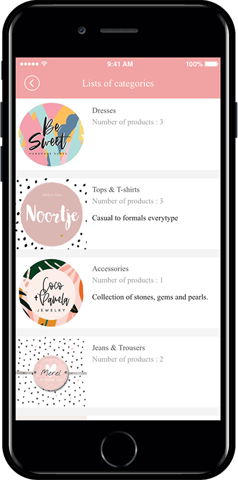

# Product Management - Product Category Registration

**The Product Category Registration Management menu is where you create and apply the product categories you want to sell.**

In other words, a clothing store categorizes clothes such as pants, dresses, jackets and blouses according to the style.

When selling digital products and reservation systems, you must create a category and then register a product for that category.

**Therefore, before you register your product with the swing store, you will need to create a product category and then register the product as that category.**

Please check the manual on how to register product categories.

Please first apply for the swing store. You need to apply for the swing store to use the menu.

☞ [**How to apply for swing store**](swingshop-apply.md)

You must apply for the swing store to create a \[Swing Store] menu at the top of the app operation page.

### <mark style="color:blue;">**1. Product Category Registration Management**</mark>

**\*Before registering a product, you must first create a category which is the top menu that includes the product.**

In the swing Shop menu, go to Products → Product Category Registration  page.

### <mark style="color:blue;">**2. Register product categories**</mark>

Product Category Registration Page.

**1) Please select the Sign up button**

**2) Category Name: Please enter the category name.**

**3) Representative image: Register the image to be shown in the main category title. (Recommended size x at least 500 px).**

**4) Category Description: Please enter a brief description of the category.**

**5) Priority: The order in which categories are shown.**

**6) Visibility: This item is to select whether to display the category directly in the app. Please check “Yes”.**

**7) Press the Save button to complete.**

<mark style="color:red;">\*Priority is placed at the top as the number is higher, and if the priority is the same, the first registered category will be placed at the top, depending on the item registration date.</mark>

<mark style="color:red;">\*Categories must include a name that includes the product. Example) Top, Bottoms, Accessories… This is what you see.</mark>

### <mark style="color:blue;">**3. Category registration completed**</mark>

The category registration is complete.

You can add more categories from the menu without limiting the number of categories.

You can edit the content by selecting that category, and you can delete the category with the \[Delete] button.

### <mark style="color:blue;">**4. How to register a category with gif**</mark>

\*After the category is registered, please go to the product registration menu and register the product to be sold.

<mark style="color:orange;">**★The created category can be applied by selecting when you register your product. ↓**</mark>

### <mark style="color:blue;">5. Apply categories to your app</mark>

You can also apply the category list directly from the app.

Maker(V2) Page → Move to Step 3 Page Menu

1. Select Home screen and click **Add a Category.** A new menu item will appear.
2. Select the new menu item and change the name in **Menu Name.**
3. Select **Swing2App Page.**&#x20;
4. Click on the **Link Wizard** icon. The **Link Wizard** pop-up window will open.&#x20;
5. Select a **Category List** from the list.
6. Click on **Reflect**
7. Click on **Apply.**
8. Click on **Save.**

**\[App Launch Screen]**

<figure><figcaption></figcaption></figure>

Category list is a style that displays a list of all the categories registered in the app.

If you select a category, you’ll be redirected to the product category screen for described above.

If you select the same product, you’ll be taken to the purchase page.
