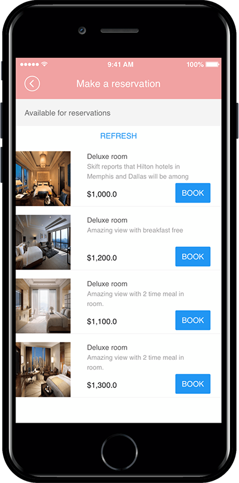
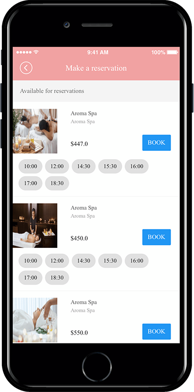

# Product management-Reservation System Operation TIP

Swing Store-The booking system is not only a reservation product, but also a method to set the date of the reservation to be purchased on a mere date. You can also register products that can be purchased at the same time as the reservation date.

So depending on what kind of product you sell –

\-Do you want to let the consumer purchase the reservation product only on the date of the reservation?

\-After selecting the reservation date, you can set the time together to purchase the reservation product.

We’ll tell you about the sales method of the reservation system through the manual.

***

**1. (Reservation date) select In-Out time**

<figure><figcaption></figcaption></figure>

First, let’s check how to register a reservation product that selects only the reservation date, how to apply the app, and how to run the app.

### <mark style="color:blue;">**01. Reservation System – Set Reservation Date**</mark>

Reservation products must be registered when the menu is applied, you can see the reservation products in the app.

Therefore, please add your reservation at Swing Store-Product Registration.&#x20;

**Manager → Shop → Reservation System**

On the product registration page, select the product type: reservation system, and select the sales period and the available date.

\*At this time, if you sell a reservation that shows only the reservation date, time reservation activation is not checked.

**★** [**Swing Store – Check out the manual for registration of reservation products**](https://support.swing2app.com/documentation/swingshop/reservationproduct/)

### <mark style="color:blue;">**02. Apply the reservation system menu to the app: Only the reservation date is displayed**</mark>

Maker(V2) Page → Move to Step 3 Page Menu

1. Select Home screen and click **Add a Category.** A new menu item will appear.
2. Select the new menu item and change the name in **Menu Name.**
3. Select **Swing2App Page.**&#x20;
4. Click on the **Link Wizard** icon. The **Link Wizard** pop-up window will open.&#x20;
5. Select a **In-Out Time** from the list.
6. Click on **Reflect**
7. Click on **Apply.**
8. Click on **Save.**
9. ****

### <mark style="color:blue;">**03. App Launch Screen**</mark>

If you look at the app launch screen with the reservation product (reservation system) applied with the reservation date, you can select the reservation date (date) and select the desired product from the list.&#x20;

Users can select and purchase a desired product on that day after selecting the reservation date.

<mark style="color:red;">**Utilization TIP**</mark>

Time-setting reservation products can be useful in industries that make reservations on a daily basis.

Example business type) It can be applied to hotels, pensions, motels, Airbnb hotels, water parks, travel products, etc.

***

**2. Select date, time and reservation**

<figure><figcaption></figcaption></figure>

Let’s check how to register a reservation product to select the date of booking, the time of the reservation, how to apply the app, and the app launch screen.

### <mark style="color:blue;">**01. Reservation System – Set the Reservation Date, Reservation Time**</mark>

Next, let’s register the reservation product that shows the reservation date and the reservation time together.

Manager → Shop → Product

On the product registration page, please select the product type: Reservation system, the sales period and the date on which it is available for sale.

\* At this <mark style="color:red;">**time**</mark>, if you check <mark style="color:red;">**\[Enable time reservation]**</mark>, the available time will be listed at that time.

The administrator can check and save only the reservation time for sale.

If you check and save the reservation date and time together, you can select the time is also displayed in the App-Booking list.&#x20;

**★** [**Swing Store – Check out the manual for registration of reservation products**](reservationproduct.md)

### <mark style="color:blue;">**02. Apply reservation system menu to app: Display Reservation date, reservation time**</mark>&#x20;

Maker(V2) Page → Move to Step 3 Page Menu

1. Select Home screen and click **Add a Category.** A new menu item will appear.
2. Select the new menu item and change the name in **Menu Name.**
3. Select **Swing2App Page.**&#x20;
4. Click on the **Link Wizard** icon. The **Link Wizard** pop-up window will open.&#x20;
5. Select a **Booking** from the list.
6. Click on **Reflect**
7. Click on **Apply.**
8. Click on **Save.**

### <mark style="color:blue;">**03. App Launch Screen**</mark>

If you look at the app launch screen with the reservation product (reservation system) which applies the reservation date and time together, you can select the reservation date (date) and see that the reservation time is displayed together in the list.

Users can select a reservation date and then select a desired time to purchase a reservation.

<mark style="color:red;">Utilization TIP</mark>

Period and time-setting pre-sale products – this can be useful in industries where you book by hour, rather than renting a day.

Example industry) You can use it at the nail salon, hair salon, hospital facilities such as dermatology, spa & massage shop, restaurant meal reservation, theater/movie and more.

***

The reservation system is a menu provided by the swing store.

Therefore, it is not available in normal apps. You must apply for a swing store (swing2app shopping mall).

Please check below on how to apply and use the Shop.&#x20;

[https://support.swing2app.com/documentation/swingshop/](./)
