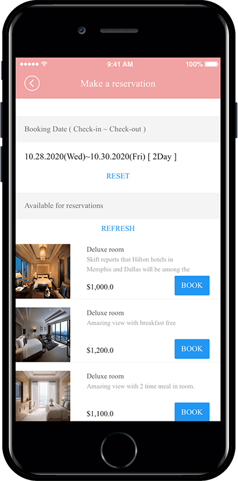
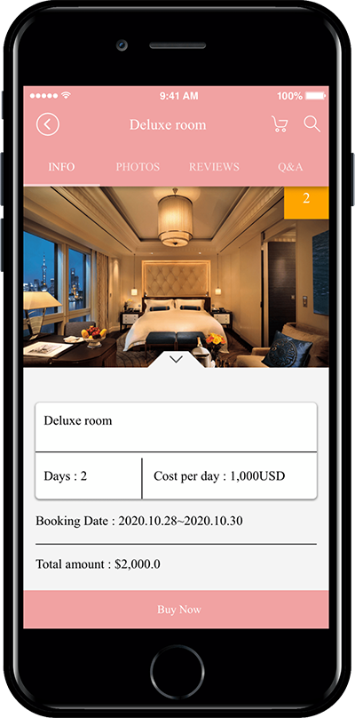
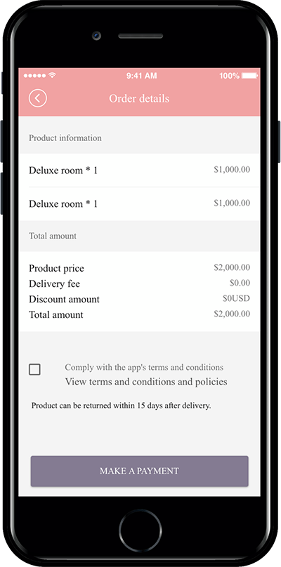

# Product Management-Reservation system product registration

**Swing Shop-How to use the reservation system**

**The reservation system allows you to sell reservation products such as hotels, camping sites and pensions.**&#x20;

**In addition, it is also useful for companies that require reservations-hair shops, nail shops, dermatology, etc.**&#x20;

**The reservation system can set the desired day, time and price for each date.**

**We offer all the options you need for sale.**

**In this manual, we will show you how to register your subscription for the date when the check-in-check-out function is displayed.**

**Please check the subscription method, application method, and application screen.**

**1. Create a category to use in the reservation system by clicking the Products → Product category registration menu → Add button in the Shop.**&#x20;

**2. Go to Product  → Product Category in Shop.**&#x20;

**3. When the reservation product registration is completed, go to the app production page and select \[Swing2App Page], then select the \[Book reservation] page.**

### <mark style="color:blue;">**STEP.1 Product Category Registration**</mark>

Please apply for a swing shop first. The swing shop must be requested before the menu is available!

**☞** [**Go to Swing Shop application**](../aff-program/apply.md)

You must apply for the swing shop to create a \[Shop] menu at the top of the app operation page.

If you have created a \[Shop], you must first register your product category.

<mark style="color:red;">**\*Rather than registering a product, you must first create a category that contains the top menu which includes the product!!**</mark>

**Go to Shop → Products → Product Category Registration Management.**

Select 1) \[Register] button on the product category registration management screen.

In the category management window, 2) Category name 2) Representative image 3) Category description 5) Priority 6) Check Display Status 7) Select Save button.

<mark style="color:red;">**\*Priority is placed at the top as the number is higher, and if the priority is the same, the first registered category will be placed at the top, depending on the item registration date.**</mark>

<mark style="color:red;">**\*Categories must include a name that includes the product. Example) top, bottoms, accessories… Like this.**</mark>

Category registration is complete.

Categories can still be added from that menu without limiting the number of categories.

You can edit the content by selecting the category, and delete the category within the \[Delete] button.

### <mark style="color:blue;">**STEP.2  Product Registration for Reservation**</mark>

**Let’s register a reservation product is category registration is completed!**

Go to Shop → Products → Product Item Registration.

1\. Product type: Reservation system.

2-1. Daily Sales: Please enter the quantity to be sold per day.  (I forgot to list the numbers and mark them 2-1;)

2\. Expiration date: Enter the period of time the product will be sold. Press the calendar button to set the date range.

3\. Set sale date: If you do a sale on the same day, please enter the number 0, and the next day (the next day) sale with the number 1.

4\. Weekly Reservation Activity: Please select the day of the week to sell the product.

5\. Non-working days: If you select a number in your calendar, a blue circle will appear, and you can designate the day checked in blue as a non-working day. (Individual non-working days can be specified)

6\. Enable time booking: You can add time in addition to selling reservations by date. \*The time reservation setting will be explained again below!

7\. Product name: Enter the product name.

8\. Product Representative Image: Register the representative image shown on the product purchase page.

9\. Registration status: You can select Available, Out of stock, Not available, Temporary registration status.

10\. Product Price: Enter the product price.

11\. Batch order: List the order in which the products are displayed in the corresponding category.

12\. Product Category: Please select the product category.

\*As mentioned above, you must create a product category first so that you can select a category in the product registration! Don’t forget to create a category first.

<mark style="color:blue;">**★ Set Time Schedule**</mark>

In the reservation product, a Time Setting option has been added to select a reservation time.

After selecting the reservation date above, you can set the reservation time.

**If you need to set your reservation time together, you can check \[Enable Time Reservation] and select the available time zone.**&#x20;

**▶ **<mark style="color:orange;">**App Launch Screen**</mark>

<figure><figcaption></figcaption></figure>

After selecting a date when purchasing reservation – You can also select a reservation time.

**★ Select the manual below to set up the time reservation product\~!**

[**\[Go to see the manual for registering time-booking products\]**](https://wp.swing2app.co.kr/documentation/swingshop/timereservation-product/)

<mark style="color:red;">**\[Important Time Setting Guide]**</mark>

**1)New features should be used after updating the app**.

Apps created after March 22, 2019 are automatically reflected.

For previously created apps, please update your app to the new version by pressing \[App Creation Request]. (Soft update available)

2\) **Reservation time can be done only once per hour.**

You can’t make multiple reservations at one time, can only make one reservation. The time when the reservation is completed is displayed on the screen as reservation complete

(2 teams reservation at 2 pm, 3 teams reservation at 3 pm X → Only 1 team is allowed for reservation)

Let’s explain the product registration again!

13\. Select payment method by product : Check payment, PAY APP(Pay App) Card Payment.

14\. Offer a discount : Select whether you want the product to appear at the original price or apply a discount.

\*If you check the discount as “Yes”, you will see an option window that sets the discount amount period.

15\. Use inventory management: Check whether you want to use product inventory management. \*Reservations don’t need to be stocked, so you can skip.

16\. Availability: You can use the optional item in addition to the reserved product.

Example) You can set options and option amount by adding breakfast, adding disposable items, adding beds, etc.

<mark style="color:orange;">**▶ For more options, check out the image below!**</mark>

17\. Product Brief Description: Enter a simple one-line description to introduce the product.

18\. Product Description: Please use the editor program to write a detailed information such as product image, description, product information, refund and exchange.

19\. Product detailed image: Register product image. Multiple images can be registered and their order can be changed.

20\. Order Form Item: Fill in the order form if you have more information to receive, otherwise you do not need to complete it.

21\. Order Message: If you don’t have a specific message, you can skip.

22\. Click the \[Save] button to complete the reservation system product registration.

**——–Product registration is complete. You can check the registered product in the product inquiry.——–**

You can find a list of all the registered products in the product search menu.

If you need to modify the content of the product, select the product you want to modify with the mouse.

Go to the product registration modification screen.

### <mark style="color:blue;">**STEP.3 Apply the reservation system to the app**</mark>

Maker(V2) Page → Move to Step 3 Page Menu

1. Select Home screen and click **Add a Category.** A new menu item will appear.
2. Select the new menu item and change the name in **Menu Name.**
3. Select **Swing2App Page.**&#x20;
4. Click on the **Link Wizard** icon. The **Link Wizard** pop-up window will open.&#x20;
5. Select a **In-Out Time** from the list.\
   <mark style="color:red;">\*If you have registered only the date at the time of registration for the reservation product → Book the reservation product (set the period) / If you have registered the date + time together → Select the reservation product reservation (time, single) menu.</mark>\

6. Click on **Reflect**
7. Click on **Apply.**
8. Click on **Save.**

<mark style="color:orange;">**+ Add**</mark>

There should also be a page where users can check the list of purchases or payment status after purchasing the pre-orders, right

If you look at the menu on the swing page, it says “My Profile.”

Please apply My Profile as the app menu!

Maker(V2) Page → Move to Step 3 Page Menu

1. Select Home screen and click **Add a Category.** A new menu item will appear.
2. Select the new menu item and change the name in **Menu Name.**
3. Select **Swing2App Page.**&#x20;
4. Click on the **Link Wizard** icon. The **Link Wizard** pop-up window will open.&#x20;
5. Select a **My Profile** from the list.
6. Click on **Reflect**
7. Click on **Apply.**
8. Click on **Save.**

**▶ **<mark style="color:orange;">**See My Page for Apps**</mark>

If you select the Delivery Complete/Purchase Complete menu on My Page, you can check the pre-orders you purchased.

Not only does My Page check the completion of the purchase, but it also provides delivery status and document viewing function when purchasing digital products.

In addition, there are many other functions such as the main product and the hot product view.

### <mark style="color:blue;">**STEP.4 App launch screen) running a reservation system**</mark>

<mark style="color:orange;">**Let’s run an app with a reservation system and check it out!**</mark>

The Date Booking product is displayed with the Check In – Check Out function on the Calendar screen.

Therefore, the date you set first is displayed in check-in, and the date you select next appears as check-out.

You can set the desired period of 1 night, 2 nights, 3 nights, etc.

<figure><figcaption></figcaption></figure>

If you select the date and period, the available products will be displayed.

Click Schedule to move on to the next step.

<figure><figcaption></figcaption></figure>

Please press \[Buy Now] button.

At this time, you can choose between Pay app card, electronic payment, and bankbook deposit.

<figure><figcaption></figcaption></figure>

Please check the phone number authentication number on the order details page.

If you proceed with the payment request, the payment will proceed.

This app is a test app, so it can’t be paid in real life.

It will be canceled immediately after payment of 1,000 won.

**\*The reservation system can be used by various companies in addition to the accommodation reservation shown in the post.**

**Register your desired products such as hair shop, nail shop reservation, and hospital reservation. You can use the reservation system function conveniently in the app.**

<mark style="color:orange;">**★Please select the post link below to set up a time-booking product other than a date-booking product such as Check-in\~!!!!**</mark>

[**\[Go to see the manual for registering time-booking products\]**](timereservation-product.md)

