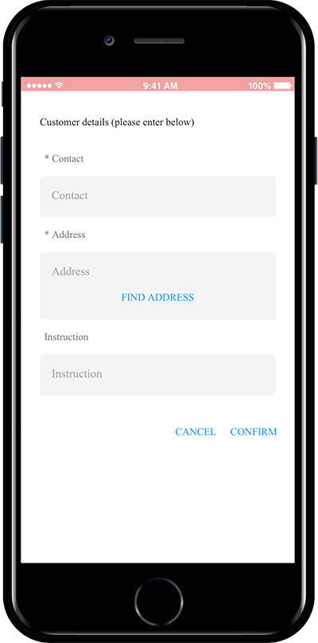
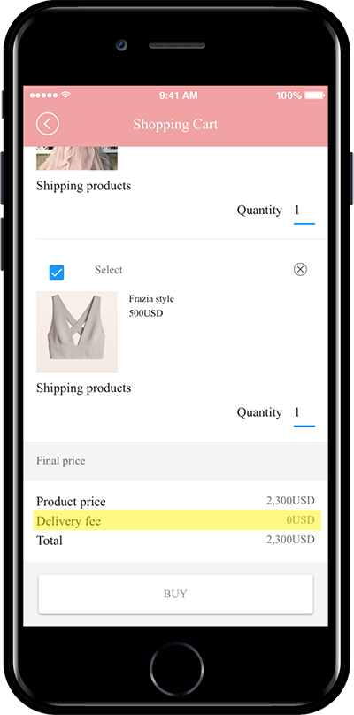

# Store Management - Shipping Management

****

**Swing Store Management – We will tell you how to use shipping management.**

Shipping management is a menu where you can enter the upper limit on the amount of goods that can be shipped and is free of charge.

**When you apply the physical goods that need to be delivered to the swing store service, you can set the information, shipping, etc. to be received when shipping through the shipping management menu.**

Therefore, when setting the shipping cost – Please set in the Shipping Management page.

**You can also fill out the order form on the Shipping Management page when you pay for an item or when you receive the information the customer needs.**&#x20;

**Swing store management through the manual – We will check how to use the shipping management and the app launch screen with the actual delivery management menu.**

***

### <mark style="color:blue;">**1. Delivery Management**</mark>

**After applying the swing store, go to swing store → shop management → delivery management page.**

****

### <mark style="color:blue;">**2. Enter shipping management item**</mark>

**Please enter the shipping cost on the Shipping Management page.**

<mark style="color:red;">\*Please enter the page if there is a shipping fee. If the shipping is free, you do not need to enter it.</mark>

1\)Default shipping rate setting: Please enter the amount of the shipping cost to be set.

2\)Free Shipping Set: Please enter the amount of goods that can be shipped free of charge.

\= If you enter $30, products over $30 will be shipped free of charge, and items under $30 will be charged with the shipping cost set above.

3\) Press the Save button to complete.

<mark style="color:red;">\*Shipping entry is not required but optional.</mark>&#x20;

<mark style="color:red;">If you have any information that you need to receive at the time of ordering, you can fill out the form accordingly.</mark>

***

### <mark style="color:blue;">**3. Shipping Entry**</mark>

After entering the contents in the shipping entry, let’s see how the contents appear in the app.

Shipping entries are available from the menu on the right.

**1)Input \[Input Field Name] 2) Check Required Input 3) Select Input UI Type and press 4) Add button.** &#x20;

If there is no UI to use in the input UI, add it by selecting the style you want.

Example) If you enter a delivery request, check and edit the input UI to ‘Sentence Input’.

When you have added all the items, click the **\[Save]** button.

<mark style="color:orange;">**▶App Launch Screen**</mark>

<figure><figcaption></figcaption></figure>

As you can see in the image above, when you make a purchase (the screen before you go to the payment page), you will see an order form page.

> **You are required to enter the shipping item information entered above.**
>
> **\*But as mentioned earlier, shipping input is not required.**&#x20;
>
> **You don’t have to repeat them again because you’ll be asked to fill in your address, phone number, and requests information on the payment page that follows.**
>
> **If you need anything other than this information, you don’t need to use it if you don’t need it.**

<mark style="color:orange;">**▶How to enter shipping management**</mark>

***

### <mark style="color:blue;">**4. App Launch screen**</mark>

After you set your shipping amount, let’s run the app to see how it will look like in your app.

<mark style="color:orange;">**▶Free Shipping**</mark>

<figure><figcaption></figcaption></figure>

\=When you pay for a product that costs more than $2000, it will be marked as ‘0’ without shipping.

<mark style="color:orange;">**▶Shipping Included**</mark>

<figure><figcaption></figcaption></figure>

\= When paying for a product with a price less than $2000, the total sum is calculated by including the $150 shipping fee set above.
