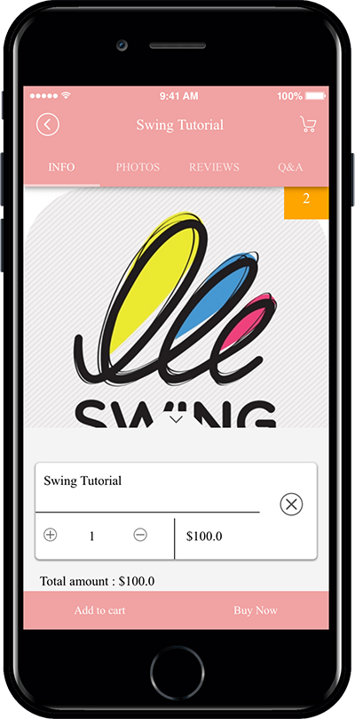

# Product Management - Digital Products: Video Files Registration

**How to register video files among Swing Store digital products**

Swing Store is a shopping mall service provided by Swing2App!

Swing Store can be registered by selecting a variety of product types – physical products, reservations products, digital products, etc.

Digital products are the type of product that sells intangible content. You can register \[change permissions, view PDF, videos and files sales, coupons]

In this manual, you will be informed of digital products – how to register videos and files, and how to apply the app.

***

### <mark style="color:blue;">**STEP.1 Product Category Registration after Swing Store Application**</mark>

**Please apply for a swing store first. Swing store must be requested before the menu is available!**

**☞**[ **How to apply for Swing Store**](../aff-program/apply.md)

You must apply for a swing store to create a \[Swing Store] menu at the top of the app operation page.

If you created a \[Swing Store], you must first register your product category.

<mark style="color:red;">**\*Rather than registering a product, you must first create a category that contains the top menu which includes the product!**</mark>

**Move to Swing Store → Product Management → Product Category Registration Management menu.**

Select 1) \[Register] button on the product category registration management screen.

In the category management window, 2) Category name 2) Representative image 3) Category description 5) Priority 6) Check display status 7) Select save button.

<mark style="color:red;">**\*Priority is placed at the top as the number is higher, and if the priority is the same, the first registered category will be placed at the top, depending on the item registration date.**</mark>

<mark style="color:red;">**\*Categories must include a name that includes the product. Example) top, bottoms, accessories… Like this.**</mark>

Category registration is complete.

Categories can still be added from that menu without limiting the number of categories.

You can edit the content by selecting the category, and delete the category with the \[Delete] button.

***

### <mark style="color:blue;">**STEP.2 Select Digital Products \[Video and File Sales]**</mark>

<mark style="color:orange;">**We will be registering a digital product – video and file sales if the registration is completed.**</mark>

Go to Swing Store → Product Management → Product Registration.

1\. Product type**:** Select ‘Digital’.

2\. Select digital product type: Select from <mark style="color:blue;">\[Change permissions, view PDF, videos and files sales, coupon]</mark>.

In this post, you’ll be registered by selecting **‘Video and File Sales**‘!

3\. Upload videos and files: Upload the file you want to register.

4\. No external sharing and interlocking.

<mark style="color:red;">**-If you can’t share purchased videos and files, and want to check only in the app, please check ‘Do not share or sync externally’.**</mark>

<mark style="color:red;">**-If you don’t mind sharing and interlocking externally, please uncheck it.**</mark>            &#x20;

5\. Product name: Enter the product name.

6\. Product Representative Image: Register the representative image shown on the product purchase page.

7\. Registration status: Select Available for sale, Out of stock, Suspension of sale, Temporary registration status.

8\. Product price: Enter the price to sell.

9\. Batch order: List the order in which the goods are displayed in the corresponding category.

10\. Product Category: Select the product category.

<mark style="color:red;">**\*As mentioned above, you must create a product category first so that you can select a category in the product registration! Don’t forget to create a category first.**</mark>

11\. Payment method by product: Please check PAY APP (pay app) card payment.

<mark style="color:red;">\*Digital products cannot be used as non-bank accounts and electronic payment modules must be applied.</mark>

12: Offer a discount:  Select whether you want the product to appear at its original price or to apply the discount.

<mark style="color:red;">**\*If you check the discount as “Yes”, you will see an option window that sets the discount amount and period.**</mark>

<mark style="color:red;">**\*The discount amount must be entered in the final discounted amount.**</mark>

13\. Use inventory management: Check whether you want to use product inventory management. / If you check the quantity, please enter the quantity to sell.

14\. Availability: You can use it if you add an optional item to your product.

Digital products did not set options separately. If you set the option, please check the gif image below!

**Examples: You can set options and the amount of options by adding sizes, adding colors, and more.**

****

**▶ **<mark style="color:orange;">**For more options, check out the image below!**</mark>

15\. Product Brief Description: Enter a simple one-line description to introduce the product.

16\. Product Description: Please write details such as product image, description, product information, refund and exchange using the editor program.

17\. Product detailed image: Register the product image. Multiple images can be registered and can be reordered.

18\. Order form items: If you have any information you need to receive, please fill out the order form.

19\. Ordered Message: If you don’t have a specific message, you can skip.

20\. Click the \[Save] button to complete the registration of the product.

**—The product has been registered. Registered products can be found in the product inquiry.—**

You can find a list of all the products you’ve registered in the Product Search menu.

If you need to modify the contents of the registered product, please select the product you want to modify with your mouse.

Go to the product registration modification screen.

***

### <mark style="color:blue;">**STEP.3 Applying Product Categories**</mark>

<mark style="color:orange;">**Once you’ve registered your digital product above, we’ll apply a page in the app where you can purchase the actual products.**</mark>

Please go to the Maker(V2) page.

1. Move to the page menu step of the app production step. Click the **Add New Category** button on the Main Menu to add the menu.
2. Enter a name in the menu you created.
3. Select the **Product Category** in the **menu type.**
4. Click on **Link Wizard** and add enter the web link address (URL).
5. Search for the product category you want to assign.
6. Select **Reflect.**
7. Select the **Apply** button.
8. Press the **Save** button.

***

### <mark style="color:blue;">**STEP.4 App Launch Screen) Digital – Purchase Video File**</mark>

You can buy video files applied to your app.

You can check the purchased video on My Page.

<figure><figcaption></figcaption></figure>

★Swing Store Digital Products: If you want to check the apps where your videos and files are registered.

Please check the swing2app school sample app below.

**☞** [**Visit Swing2App School Sample App**](https://blog.naver.com/swing2app/220462318083)
