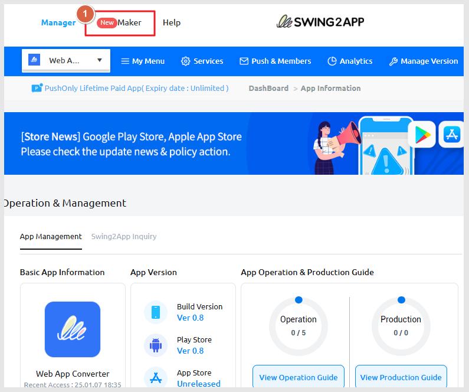
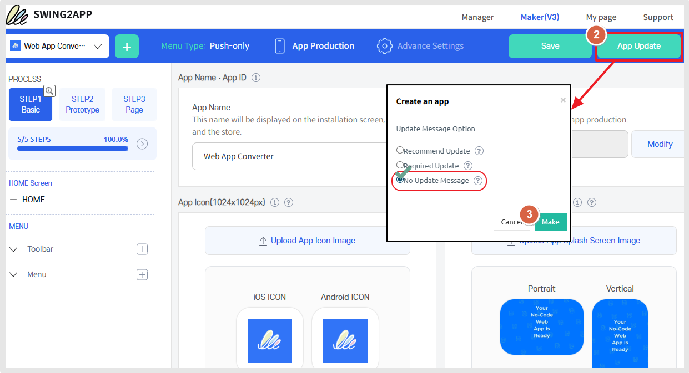
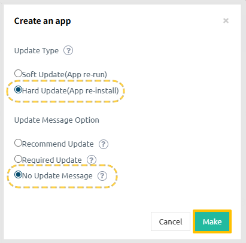
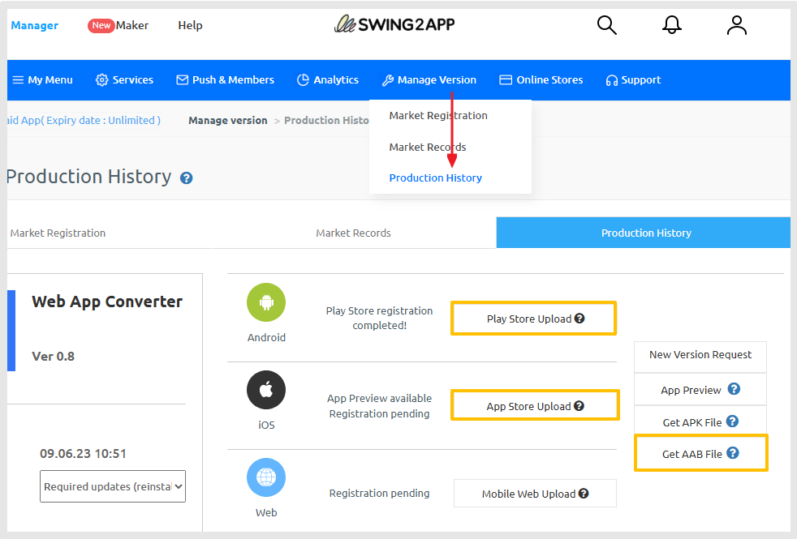

# App Update

***

## **1. App Update**

<figure><figcaption></figcaption></figure>

1\)Go to the 'Maker' screen.

<figure><figcaption></figcaption></figure>

2\)Click the **\[App Update]** button on the top right.

3\)Check the "No Update Message" and click **\[Make]**.

For Push Apps: Select **"No Update Message"**.

📢For **General Prototype Apps**:

<figure><figcaption></figcaption></figure>

-Update Type: Select **"Hard Update (App Re-install)"**.

-Update Message Option: Select **"No Update Message"**.

***

## **2.App Production Completed**

<figure><figcaption></figcaption></figure>

After starting the update, go to [**Manager> Manage Version> Product History**](https://www.swing2app.com/view/app_work_history)**.**

Once you proceed with production, the app will be rebuilt as a new version.

* General prototype apps: Built within 5 minutes
* WebView and push apps: Built within 10 minutes

For those submitting an upload request, the “Upload Request” button will be activated once the production is complete.\
Please click the button at that time and submit the request form.

For paid apps (apps with a valid subscription), the AAB file can be downloaded from the App Production History page.

App creation may take up to 10 minutes. Once completed, the '**Get AAB File'** button will be activated.

Download the AAB file and proceed to the Google Play Console.
