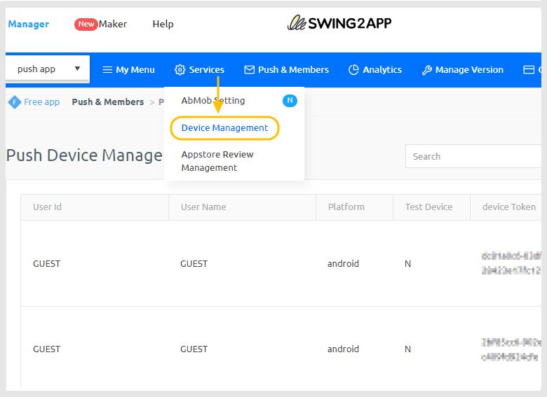
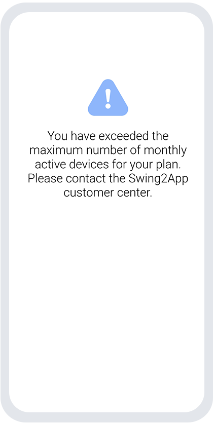
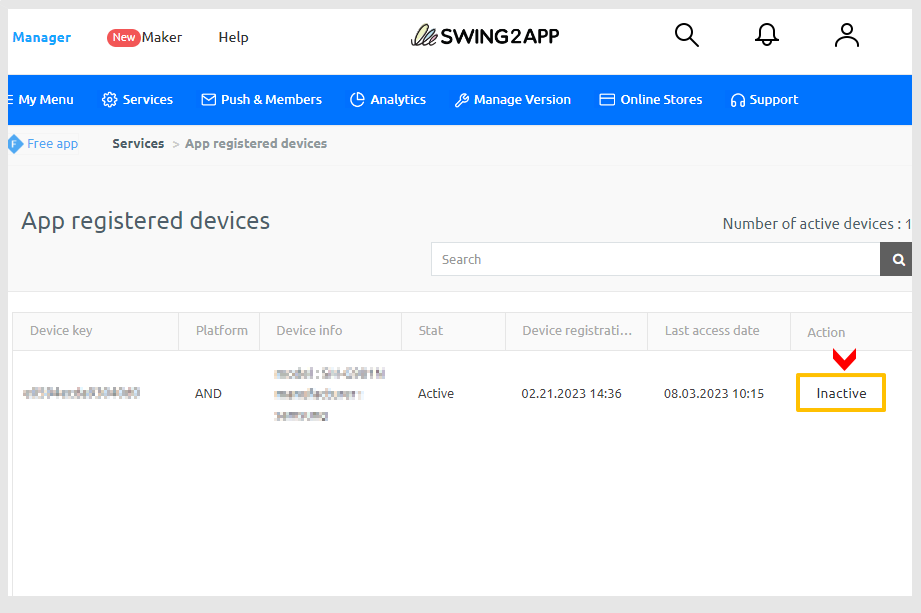

# Limit on the Number of Devices for Free User

## **1.** Scope of Swing2App Free Version App Use

* The free version app can be used for personal (non-commercial) purposes and for testing only.&#x20;
* The number of devices that can install the app is limited to 10.&#x20;
* If the number of devices exceeds 10, measures such as usage restrictions and suspensions will be applied.&#x20;
* The free version app cannot be used for commercial or distribution purposes.

## 2. How to Check the Number of App Installation Devices

1\) Regular prototype app and push app users can check the number of devices in push device management.

Go to [Manager -> Push & Members -> Push Device Management](https://www.swing2app.com/view/push\_device\_management)&#x20;

<figure><figcaption>
Swing2App Console
</figcaption></figure>

2\) Webview app users can check in the [Manager -> Services -> App registered devices](https://www.swing2app.com/view/app\_device\_management) menu

<figure><figcaption>
Swing2App Console
</figcaption></figure>

### 3. If the number of installed devices exceeds 10 in the free version app 

The app will be suspended, and a page like the one below will appear, making the app unusable.

<figure><figcaption>
Example of the restriction message
</figcaption></figure>

Since the app is not deleted, you can solve the problem by checking the action method.

## **4.** Measures to Take

### **1)** If you want to keep the users and use the app

Please purchase a paid app usage license.

When you go to the license purchase page, you can purchase a license that suits the app you created.

[Swing2App paid app usage license purchase page](https://www.swing2app.com/view/new\_product\_list\_by\_use\_term)

\* Webview app and push app users can purchase with an 'unlimited' paid app license. Web app exclusive unlimited usage license purchase page.

[Webview app lifetime license purchase page](https://www.swing2app.com/view/new\_product\_list\_by\_use\_term)

**\*If you only purchase a paid app usage license, the suspended app will be restored.**

\-If you purchase a license, you can download the app without limits on the number of installations.

\-Paid apps can also be released and distributed on the Play Store and App Store.


It's common to release an app with a purchased paid app license in the store and use it. It is recommended to release and use it on the Play Store and App Store rather than installing the app file.&#x20;

If you release it in the App Store, you can also use the app on iPhone.&#x20;

\*Separate purchase of upload ticket required&#x20;

(Play Store upload ticket $10, App Store upload ticket $20)

[Direct link to Play Store upload application method](https://documentation.swing2app.com/manual/appmanage/version/playstore-upload)

[Direct link to App Store upload application method](https://documentation.swing2app.com/manual/appmanage/version/appstore-upload)



\*After purchasing a paid app license, the app will not be compatible with previous versions when updated.&#x20;

No update notice window will pop up. (Since the previous version was in the free app state, it cannot be linked with the paid app)&#x20;

Please delete the existing app and reinstall it with the current version to use it, or release and use it in the store (Play Store, App Store) as advised.


### **2)** If you maintain the free app usage

**If you want to continue using the free app without purchasing a paid app license, please adjust the number of installed devices to 10.**

Go to [Manager -> Services -> App registered devices](https://www.swing2app.com/view/app\_device\_management) menu and you can 'deactivate' registered user devices.

<figure><figcaption></figcaption></figure>

**\*Select the \[Inactivate] button**

<mark style="color:red;">However, this method is not recommended.</mark>

<mark style="color:red;">Since this is a temporary deactivation of the app on the device, it will change to the active state when the user runs the app again.</mark>&#x20;

There is no way to forcibly delete it.

### **3)** Unused apps

If the app is no longer in use or is not planned to be used, no action is necessary.&#x20;

However, as the app will continue to be unusable, if you want to use it again as a free app, you need to create a new app to use.

The free version app is not for distribution, so you can only install and use the app for testing (personal use).

Therefore, if you are using it to distribute to many users, we ask you to use the paid version.
