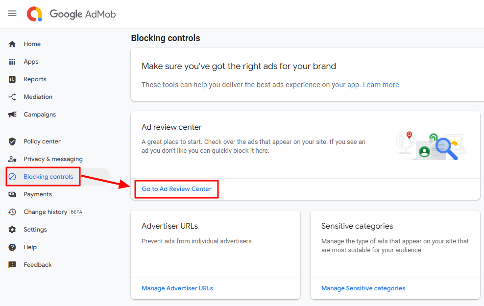
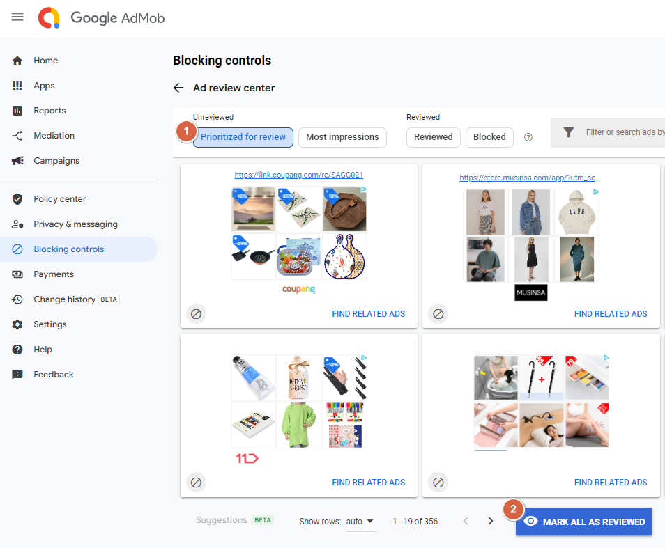
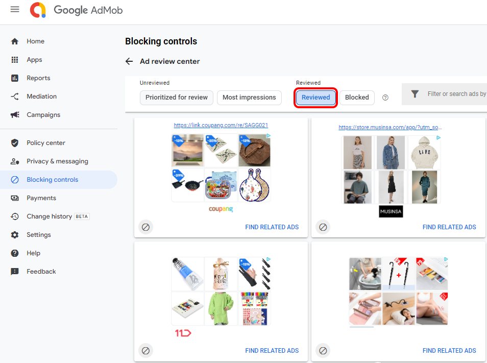
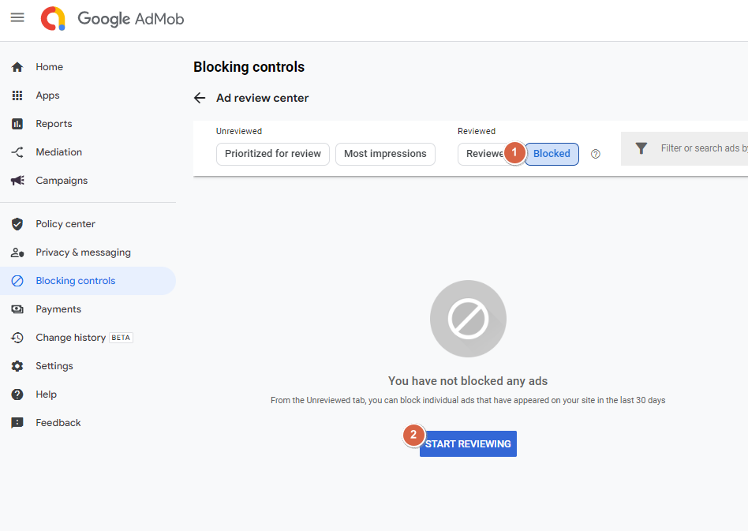

# Admob Operation Precautions

**AdMob Operations – Adding payment information, checking un-reviewed and blocked ads**

After applying for Admob Operation, you should be familiar with how to operate Admob ads.

**1) Enter your payment information**

If your admob payment information is missing, your ads won’t be displayed.

**2) Manage un-reviewed and blocked ads**

If the ad is not reviewed, it will not be displayed in the app. If you see any un-reviewed ads, you should check and change them to review.

 (1).PNG>)

### <mark style="color:blue;">**1. Enter Payment Information**</mark>

After logging in to the admob, if you look at the main dashboard, can you see the missing payment information?

**There is a message stating that your payment information is missing.** <mark style="color:red;">\*If your payment information is missing, please make sure to add it or your ad won’t be displayed.</mark>

Please enter the **\[Add payment information]** menu.

The payment information entry page will add your payment profile.

**Account Type (Personal or Business Choice) Complete Address, postcode, name, and phone number.**

.png>)

Once you’ve completed your payment profile entry, go back to the main dashboard, and you’ll see that your status has changed to **\[Account Approved]**.

Your account information has been verified so your ads will be displayed.

<mark style="color:red;">\*Admob can enter the method of receiving payment when the standard revenue provided by Admob is not entered when entering the account information.</mark>

<mark style="color:red;">Therefore, you will not enter an account, bank, etc on which you want to receive revenue.</mark>

 (1).PNG>)

### <mark style="color:blue;">**2. Block management – manage app ads**</mark>

Once you’ve entered your payment information, make sure there’s no un-reviewed ads are in Block Management so that your ads can be published.

From the left menu \[Blocking controls] → \[go to the Ad review center] menu Click.

<mark style="color:orange;">**1) Un-reviewed ads**</mark>​

1\)If you select \[Prioritized for review], you will see ads that have not yet been reviewed, as in the image above.&#x20;

2\)You should change the status to ‘Reviewed’ by selecting the \[Mark all as reviewed] button.

If you select the \[Reviewed] menu, you’ll see that previously un-reviewed ads are “Reviewed”.

\*\*Admob ads will not be posted to your app if there are un-reviewed ads.

Therefore, you should tap the un-reviewed ad menu to check for any un-reviewed ads.

​

<mark style="color:orange;">**2) Blocked Ads**</mark>

Even if you don’t have any un-reviewed ads in the first place, if you have blocked ads, they won’t be published.

Therefore, please select the reviewed advertisement 1)\[Blocked]menu and 2)\[START REVIEWING] button.

If no ads are blocked, they will appear like the image above, but if there are blocked ads, they will appear together on the screen.

You should check, review and remove the blocked ads.


Admob should check the below items after creating an ad Unit ID.

**-Please complete the payment information and get your approval.**

**-Blocking and un-reviewed ad management can be posted as soon as possible if you proceed in advance after signing up, so please make sure to create an ad unit ID before you proceed.**

Please check your ad management from time to time to make sure there are no un-reviewed or blocked ads.

​

If you have subscribed to AdMob plugin, please make sure to check the contents above so that the posting of app ads is not delayed!


