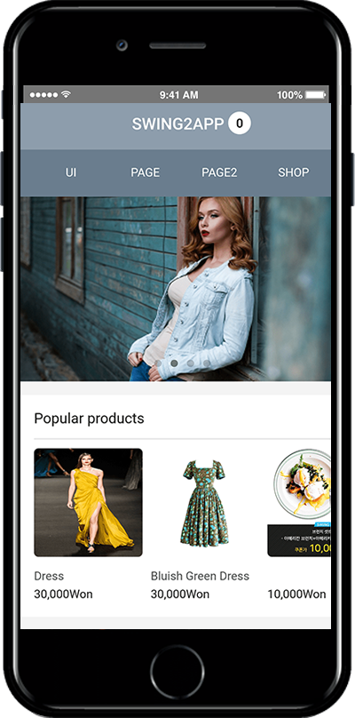
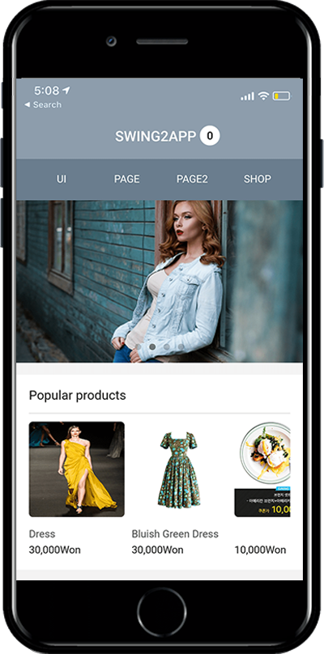
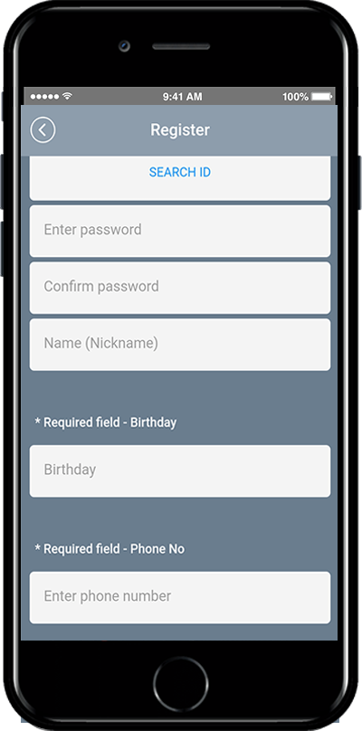

# AppStore App Rejection Cases

**App Store App Launch TIP**

**App Store Review App Policy-Review Decline Case.**

**Check-in advance and follow these policies well at once! Please pass the App Store screening and be released.**

### <mark style="color:blue;">**1. Metadata Policy Violation**</mark>

**★ Please check the data entered in the app.**

1\) If nothing is listed in the app

2\) If you select a bulletin board but there are no posts

3\) Content that contains offensive content, offensive content, and sexual images.

when the app is built, the data is well contained in the app! Please check for any violations of our policies.

### <mark style="color:blue;">**2. Check for weblink errors**</mark>

**★ Please check if the web link is properly connected.**

There are web links linked to the app.

However, **if you can’t find the address because you entered the wrong web link URL, or if it says the wrong web link address, it’s** also a reason for refusing to review the App Store.

1\)Incorrect web link URL address

2\)This is also the case with third party platform information.

For example, in an app, you’ll be described as Apple, but when you go to the link, you’re going to the next →Google.

3\)If you provide platform information from other third parties, not platform information operated by the app, you may be refused to review.

Therefore, when creating an app, the **‘web link’** part is a must. Please check

### <mark style="color:blue;">**3. Loading images used only on iPhone**</mark>

**★All images with Android display other than the iPhone are rejected.**

Normally, when you apply for upload, both the Play Store and App Store will include **screenshot images**.

At this time, there is a case of refusal that occurs frequently.

This is to attach the image captured by the Android phone to the App Store screenshot image.

**However, the App Store will refuse to review images that are used on Android phones instead of images used on the iPhone.**

<mark style="color:orange;">**▶Top bar image is shown on Android phone**</mark>

<figure><figcaption></figcaption></figure>

<mark style="color:orange;">**▶Top bar image is shown on iPhone**</mark>

<figure><figcaption></figcaption></figure>

As you can see from the image attached above, you can see the difference between the top bar image of the Android phone and the top bar image of the iPhone.

**Therefore, when you insert a screenshot image, either delete the top bar image or edit and register the image for iPhone.**

### <mark style="color:blue;">**4. You can’t have poor-quality images.**</mark>

**★ Please complete the app icon image, standby screen image, screenshot image, etc. with a high-quality image.**

Due to the nature of Swing2App’s app, there are cases where an image is created with poor image quality and very poor image quality.

It doesn’t matter when you build an app for free, but it’s a problem when you put it on the App Store.

This includes the Play Store.

\[Images with very low resolution]

**You can’t have a blurry image because the resolution is lower than the image attached above.**

Occasionally**, even if the icon image, the standby screen image, and the like are submitted without changing the image set in the swing2app,  it is rejected by the review.**

All images are registered directly according to the nature of the app.

### <mark style="color:blue;">**5. It doesn’t even ask for personal information.**</mark>

**★ Please delete the item that asks for the user’s information-phone number (contact), gender, age, etc. from the membership page within the app.**

**When creating an app, the member registration page can be set and edited by the user**.\
However,  the item that asks for personal information, such as the user’s phone number, will be rejected based on the personal information protection grounds in the App Store.

\[Items that require personal information]

<figure><figcaption></figcaption></figure>

**In this case, the same is true when the homepage is applied to the app.**

In particular, there are cases where the user’s gender, age, contact information, body size, etc. are listed in the shopping mall, etc.

**If these items are never passed, the app store review will not pass.**

### <mark style="color:blue;">**6. Please check if you need to submit a demo account.**</mark>

**★ For the private app, if you need to sign up to see the contents of the app, you must submit a demo account.**

**1)Apps created in private**

**2)If the website is created by putting it on the app, you must register to view the contents of the homepage.**

**3)Other cases where Apple requests a demo account to check the contents**

In these cases, you’ll need to provide a demo account- ID and a non-number where you can see the contents of the app.

**If you can’t log in, Apple will ask you for an account because you won’t be able to see which app it is.**

**If you don’t tell us your account during the first launch review, your review will be denied.**

Tell us your account and we’ll be able to launch your app if we’re sure there are no issues with the app.

Also, there are so many cases of app rejection in the App Store.

I’ve only listed what I’ve experienced.

And there’s also a bug **in** the app that you should be aware of.

This can be especially true if you link to the mobile web or website.

There are so many bugs. If you select a button in the app and don’t respond,

or if you see a broken screen, other system errors, you should also check for bugs.

Therefore, please create an app and then preview it on your mobile phone to see if the app is visible on your phone.
