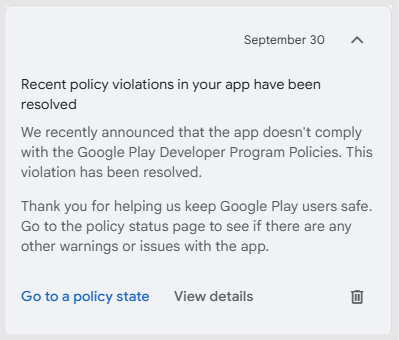
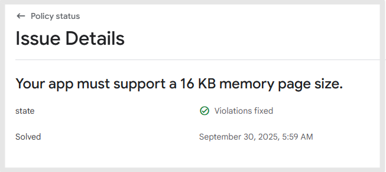

# How to Submit 16KB App Update to Google Play Store

***

How to submit an app with the 16KB setting completed to Google Play Console

From **September 30, 2025**, any newly created (or updated) apps will automatically include the 16KB memory page size setting.

This guide explains how to update your app on the **Google Play Store** to comply with the 16KB memory size requirement.

⚠️ This process must be completed directly by Swing2App users: after updating your app, you must submit it to the Play Console.

If submitting directly is difficult, Swing2App can handle the upload process on your behalf. Please refer to the **Play Store Upload Request** instructions below.


### \[How to Request a Play Store Upload]

1.Go to the 'Maker' screen and update your app first.

[Refer to the App Update Guide.](https://documentation.swing2app.com/manual/v3/step4-complete-app-creation/how-to-update-an-app)

(If you've already updated, you can proceed to step 2 to purchase a ticket and submit your upload request.)

2.Purchase a Play Store upload ticket. ($20/1 time)

[Ticket Purchase Page](https://www.swing2app.com/view/order_info_action?product_id=4) (If you already have a ticket, skip to step 3.)

3.Go to [**Manager> Manage Version> Product History**](https://www.swing2app.com/view/app_work_history), and click **\[Play Store Upload]** to request the upload.

If there are any modifications (e.g. app description, screenshots), please edit them before submission.

If not, simply click "Submit" to proceed.


***

## **1. App Update**


Please update your app via the Swing2App creation system.

The Swing2App platform now supports 16KB.

To reflect this update, users must rebuild their app and submit the new version to the Play Store.


* Applies to all apps (General Prototype, WebView App, Push App) created after **September 30, 2025**.
* To generate a version with the 16KB setting, you must update your app in the Swing2App system.
* After updating, the app must be submitted to the Play Store.

<figure><figcaption></figcaption></figure>

1\)Go to the 'Maker' screen.

<figure><figcaption></figcaption></figure>

2\)Click the **\[App Update]** button on the top right.

3\)Check the "No Update Message" and click **\[Make]**.

<mark style="color:red;">\*Push Apps: Select</mark> <mark style="color:red;"></mark><mark style="color:red;">**"No Update Message"**</mark><mark style="color:red;">.</mark>


**For WebView Apps: No popup appears during update, so no selection is needed.**

Q. Why can’t I select the update option for WebView apps?

A. WebView apps do not show update popups in the app, so the option is not necessary.


📢For **General Prototype Apps**:

<figure><figcaption></figcaption></figure>

-Update Type: Select **"Hard Update (App Re-install)"**.

-Update Message Option: Select **"No Update Message"**.

<figure><figcaption></figcaption></figure>

After starting the update, go to [**Manager> Manage Version> Product History**](https://www.swing2app.com/view/app_work_history)**.**

App creation may take up to 10 minutes. Once completed, the '**Get AAB File'** button will be activated.

Download the AAB file and proceed to the Google Play Console.

***

## **2.Google Play Store App Update Submission** 

Go to the [Google Play Console](https://play.google.com/console/u/0/developers)

<figure><figcaption></figcaption></figure>

1\)Select the app you want to update.

<figure><figcaption></figcaption></figure>

2\)Go to **Testing & Release > Production**.

3\)Click **Create New Release**.

<figure><figcaption></figcaption></figure>

4\)In the **App Bundle** section, click **\[Upload]** and select your AAB file.

**How to get your AAB file:**

<figure><figcaption></figcaption></figure>

Go to [**Manager>Manage Version> Product History**](https://www.swing2app.com/view/app_work_history)**.** and click **\[Get AAB File]**.


**Important**

* If your original release used an APK file → continue using APK.
* If it used an AAB file → continue using AAB. The update file type must match the original release format (APK or AAB).


### \*How to check if 16KB has been applied:

<figure><figcaption></figcaption></figure>

After uploading, click the **\[→ ]Details** button for the new file.

<figure><figcaption></figcaption></figure>

Confirm that the memory page size is listed as **16KB support**.

<figure><figcaption></figcaption></figure>

Click **Next**.

<figure><figcaption></figcaption></figure>

6\)Click **Save**.

7\)Click **Review and Rollout**


Warnings may appear; you can safely ignore them unless they are blocking errors.

Confirm the update status is changed to **In Review**.

If it shows **Ready to Submit**, return to the overview page and submit the release manually.


<figure><figcaption></figcaption></figure>

8\)Click **"Send OO changes for review"**

\*The number of changes may vary depending on your app.

9\)Make sure the status changes to **"In Review"**.

<figure><figcaption></figcaption></figure>

If the status remains as **"Ready to Submit"**, your app was not submitted properly.

Go to the **Release Overview** and complete the submission.

Now, wait for the review process to complete.


-Reviews usually take 1–2 days but may take up to 7 days.

-Once approved, the app update will be released.

-If rejected, you’ll need to check the rejection reason and submit a revised version.

You can check the production release status on the "Release Overview" page.

If you see messages like **"Update Rejected"**, **"Update Denied"**, or **"App Removed"**, it means the update was rejected.

Please review the Google rejection message and take the necessary actions.


***

## **3.16KB Policy Violation Resolved Message**

<figure><figcaption></figcaption></figure>

<figure><figcaption></figcaption></figure>

fter your app is updated, you should see a message indicating the policy issue is resolved.

Check for the message:

> _"Your app must support a 16 KB memory page size. – Issue resolved."_

This confirms that the 16 KB compliance has been properly processed.

> Note: This message may take up to 24 hours to appear after the update. If it doesn’t appear immediately, please wait a day and check again.

***

This guide is for users who want to submit the app update to the Play Console themselves.

If you'd prefer not to handle it yourself, you can request an upload service from Swing2App.

Refer to the **Play Store Upload Request Guide** above for help.


### \[How to Request a Play Store Upload]

1.Go to the 'Maker' screen and update your app first.

[Refer to the App Update Guide.](https://documentation.swing2app.com/manual/v3/step4-complete-app-creation/how-to-update-an-app)

(If you've already updated, you can proceed to step 2 to purchase a ticket and submit your upload request.)

2.Purchase a Play Store upload ticket. ($20/1 time)

[Ticket Purchase Page](https://www.swing2app.com/view/order_info_action?product_id=4) (If you already have a ticket, skip to step 3.)

3.Go to [**Manager> Manage Version> Product History**](https://www.swing2app.com/view/app_work_history), and click **\[Play Store Upload]** to request the upload.

If there are any modifications (e.g. app description, screenshots), please edit them before submission.

If not, simply click "Submit" to proceed.


