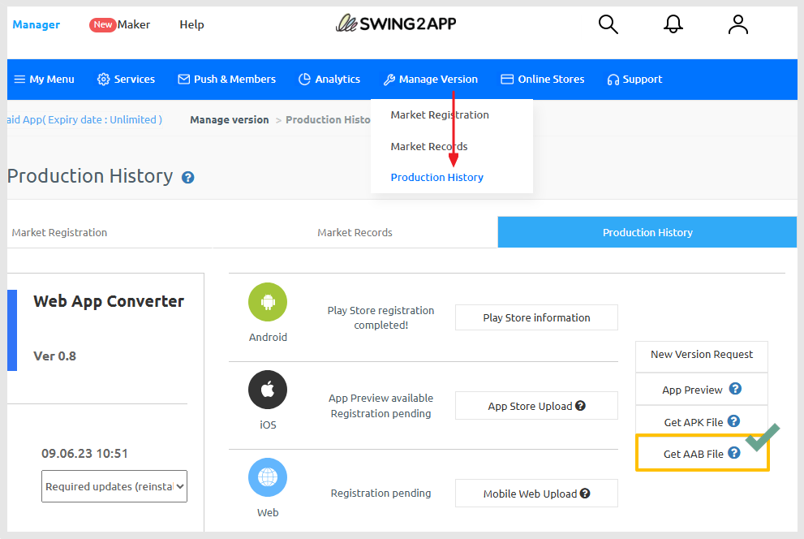
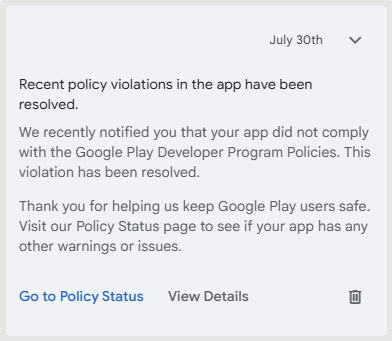
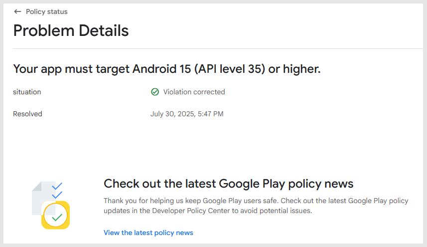

# How to Submit API 35 Version App Update to Google Play Store

***

This guide explains how to update your app to target API level 35 on the Google Play Store.

**Important:**

This process must be completed by Swing2App users directly.&#x20;

After updating the app, you must submit it via the Google Play Console.

If you're unable to submit it yourself, you may request an upload service from Swing2App.&#x20;

We will handle the entire process for you.

Please refer to the following guide on how to request a Play Store upload.


### \[How to Request a Play Store Upload]

1.Go to the app creation screen and update your app first.

[Refer to the App Update Guide.](https://documentation.swing2app.com/manual/v3/step4-complete-app-creation/how-to-update-an-app)

(If you've already updated, you can proceed to step 2 to purchase a ticket and submit your upload request.)

2.Purchase a Play Store upload ticket. ($20/1 time)

[Ticket Purchase Page](https://www.swing2app.com/view/order_info_action?product_id=4) (If you already have a ticket, skip to step 3.)

3.Go to [**Manager> Manage Version> Product History**](https://www.swing2app.com/view/app_work_history), and click **\[Play Store Upload]** to request the upload.

If there are any modifications (e.g. app description, screenshots), please edit them before submission.

If not, simply click "Submit" to proceed.


***

## **1. App Update**


Please update your app via the Swing2App creation system.

The Swing2App platform now supports API level 35.

To reflect this update, users must rebuild their app and submit the new version to the Play Store.


<figure><figcaption></figcaption></figure>

1\)Go to the **App Creation** screen.

<figure><figcaption></figcaption></figure>

2\)Click the **\[Update App]** button on the top right.

3\)Check the "Update Notice Option" and click **\[Create]**.

<mark style="color:red;">For Push Apps: Select</mark> <mark style="color:red;"></mark><mark style="color:red;">**"Do not show update notification"**</mark><mark style="color:red;">.</mark>


**For WebView Apps: No popup appears during update, so no selection is needed.**

Q. Why can’t I select the update option for WebView apps?

A. WebView apps do not show update popups in the app, so the option is not necessary.


📢For **General Prototype Apps**:

Update Type: Select **"Hard Update (App Reinstallation)"**.

Update Notification Option: Select **"Do not show update"**.

<figure><figcaption></figcaption></figure>

After starting the update, go to [**Manager> Manage Version> Product History**](https://www.swing2app.com/view/app_work_history)**.**

App creation may take up to 10 minutes. Once completed, the '**Get AAB File'** button will be activated.

Download the AAB file and proceed to the Google Play Console.

***

## **2.Google Play Store App Update Submission**

Go to the [Google Play Console](https://play.google.com/console/u/0/developers)

<figure><figcaption></figcaption></figure>

1\)Select the app you want to update.

<figure><figcaption></figcaption></figure>

2\)Go to **Testing & Release > Production**.

3\)Click **Create New Release**.

<figure><figcaption></figcaption></figure>

4\)In the **App Bundle** section, click **\[Upload]** and select your AAB file.

#### How to get your AAB file:

<figure><figcaption></figcaption></figure>

* Go to  [**Manager>Manage Version> Product History**](https://www.swing2app.com/view/app_work_history)**.** and click **\[Get AAB File]**.


**Important**

* If your original release used an APK file → continue using APK.
* If it used an AAB file → continue using AAB.\
  The update file type must match the original release format (APK or AAB).


<figure><figcaption></figcaption></figure>

5\)In the **App Bundle** section, click **\[Upload]** and select your AAB file.

After uploading, check that:

* **API Level** is listed as **21 or higher**
* **Target SDK** is listed as **35**

Then click **Next**.

<figure><figcaption></figcaption></figure>

6\)Click **Save**.

7\)Click **Go to Overview**.


Warning messages may appear. You can ignore them unless they are marked as "Error".


<figure><figcaption></figcaption></figure>

8\)Click **"Send OO changes for review"**

\*The number of changes may vary depending on your app.

9\)Make sure the status changes to **"In Review"**.

<figure><figcaption></figcaption></figure>

If the status remains as **"Ready to Submit"**, your app was not submitted properly.&#x20;

Go to the **Release Overview** and complete the submission.

Now, wait for the review process to complete.


-Reviews usually take 1–2 days but may take up to 7 days.

-Once approved, the app update will be released.

-If rejected, you’ll need to check the rejection reason and submit a revised version.

You can check the production release status on the "Release Overview" page.

If you see messages like **"Update Rejected"**, **"Update Denied"**, or **"App Removed"**, it means the update was rejected.&#x20;

Please review the Google rejection message and take the necessary actions.


***

## **3.API 35 Policy Violation Resolved Message**

<figure><figcaption></figcaption></figure>

<figure><figcaption></figcaption></figure>

After your app is updated, you should see a message indicating the policy issue is resolved.

Check for the message:

> _"Your app must target Android 15 (API level 35) or higher – Issue resolved."_

This confirms that the API 35 compliance has been properly processed.

> Note: This message may take up to 24 hours to appear after the update.\
> If it doesn’t appear immediately, please wait a day and check again.

***

This guide is for users who want to submit the app update to the Play Console themselves.

If you'd prefer not to handle it yourself, you can request an upload service from Swing2App.

Refer to the **Play Store Upload Request Guide** above for help.


### \[How to Request a Play Store Upload]

1.Go to the app creation screen and update your app first.

[Refer to the App Update Guide.](https://documentation.swing2app.com/manual/v3/step4-complete-app-creation/how-to-update-an-app)

(If you've already updated, you can proceed to step 2 to purchase a ticket and submit your upload request.)

2.Purchase a Play Store upload ticket. ($20/1 time)

[Ticket Purchase Page](https://www.swing2app.com/view/order_info_action?product_id=4) (If you already have a ticket, skip to step 3.)

3.Go to [**Manager> Manage Version> Product History**](https://www.swing2app.com/view/app_work_history), and click **\[Play Store Upload]** to request the upload.

If there are any modifications (e.g. app description, screenshots), please edit them before submission.

If not, simply click "Submit" to proceed.


