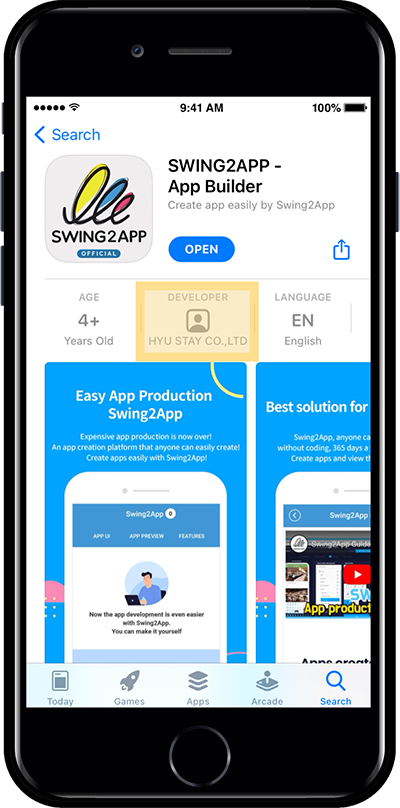

# How to change the name of Play Store Developer

**How to change your Google Play Store developer name**

▶ What is the developer name?

The developer name is the name of the user who publishes your app on the Play Store and runs it.\

Your developer name will appear under the name of your app as it appears in the store.

When you register for your first developer account, you enter the developer’s name, and Google can change the developer name after the app is released.

<mark style="color:red;">(Apple will not change the developer’s name)</mark>

***

### <mark style="color:blue;">**Q. Where does Google and Apple developer names appear?**</mark>

  <mark style="color:orange;">**Google Play Store**</mark>

**The Google developer name is displayed under the app name when the app is released on the Play Store.**

If you search for the released app name in the Play Store app as shown in the image above, you can find the developer name under the app name.

You can change the name of the developer and use it.

&#x20;

  <mark style="color:orange;">**Apple App Store**</mark>

<figure><figcaption></figcaption></figure>

It is the same for the app store.

The developer name is displayed under the app name.

<mark style="color:red;">However, as mentioned above,</mark> <mark style="color:red;"></mark><mark style="color:red;">**please note that in Apple, once registered developer name can not be changed later.**</mark>

***

### <mark style="color:blue;">**1. Change your Google Developer Name**</mark>

Then let’s check how to change the developer name\~

**※Google Developer Console site:** [**https://play.google.com/apps/publish/**](https://play.google.com/apps/publish/)

**\*Go to \[Settings] → \[Developer Account] → Developer page on the left side of the dashboard.**

[https://play.google.com/console/developers/accountdetails](https://play.google.com/console/developers/accountdetails)

On the developer page – Edit the developer name and click the \[Save] button to complete.

In addition to the name, the developer page can be used by modifying the address and contact information.

&#x20;

<mark style="color:red;">★But what if the developer name cannot be changed? Please check the content below</mark>

From November 2, 2020, according to the changed Google Play console policy, when changing a developer’s name, you must enter the contents of the developer page to change the name.

If you change the developer name and do not proceed to the next step, please check the Google developer page input method below and enter the contents.

[https://support.swing2app.com/knowledgebase/playstore-developer-page/](playstore-developer-page.md)

### <mark style="color:blue;">**2. Google Play Store developer name change completed**</mark>

<mark style="color:red;">★Time to reflect developer name</mark>

The developer name will be reflected within 1 day (usually a few hours) of the reflection time after modification.

After approval is complete, search for the app on the Play Store and you can see that the developer name has changed.

Please log in with your developer account after accessing the Google Developer Console site.

And on the left side of the main dashboard, select the Settings menu.
