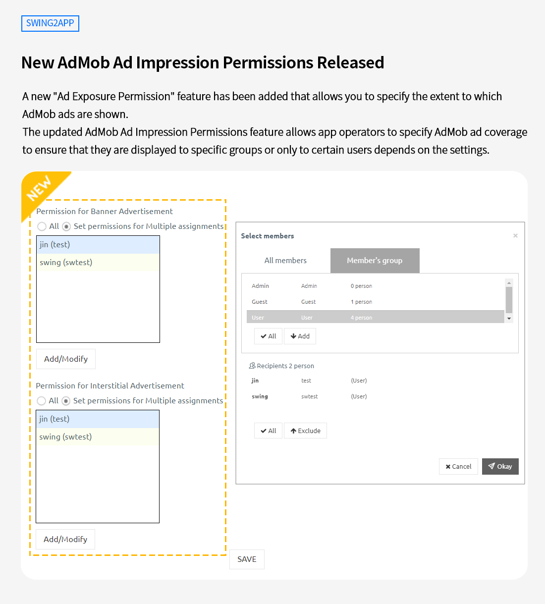

# Swing2App Update

<figure><figcaption></figcaption></figure>

###  **New AdMob Ad Impression Permissions Released**&#x20;

<figure><figcaption></figcaption></figure>

A new "Ad Exposure Permission" feature has been added that allows you to specify the extent to which AdMob ads are shown.

<mark style="color:blue;">**What are AdMob ad impressions?**</mark>

App ads created by Swing2App can be set as 'Google AdMob Ads' and are exposed as banner ads and interstitial ads.&#x20;

Ads are exposed to all users who install the app without additional access rights, but if you use the exposure permission, you can set the range in which banner ads and interstitial ads are displayed or not displayed, respectively.&#x20;

Permissions can be added by selecting members registered in the app individually, or by selecting a specific group (member group).&#x20;

Existing admob ads were visible to all users because there was no exposure permission specified.

**The updated AdMob Ad Impression Permissions feature allows app operators to specify AdMob ad coverage to ensure that they are displayed to specific groups or only to certain users depends on the settings.**

\

 **How to Use**

1\) Go to the app MakerV3 screen and update the app once. By clicking on the \[Update App] button.

<mark style="color:orange;">\*The updated AdMob function is only available in the app production V3 version. If you are using V2, please switch to V3.</mark>

2\) Select the option to display updates as 'Do not show updates' first.

3\) When the app creation is complete, please visit the [AdMob plugin settings](http://www.swing2app.co.kr/view/app\_plugin\_by\_admob).

4\) AdMob Settings Screen - You can see that the \[Exposure Permission Settings] input item has been added to the banner and interstitial ads.

<figure><figcaption></figcaption></figure>

5\) Select multiple specified permission settings, and then select \[Add/Edit button]

<figure><figcaption></figcaption></figure>

→Add each member (user) or group registered in the app and select the \[Save] button.

→If you do not set any permissions, you can set it to "Full Exposure".&#x20;

→ advertisement is exposed to groups and users added to the assignment permission settings.&#x20;

\*Select the group you want to expose your advertisement to.

6\) Download the newly created app (updated version app) again and check it.

\* You should first delete the app that you downloaded from the Play Store and then install the updated version of the app on your phone.

\*App on iPhone cannot be tested without updating its latest version on the App Store.

7\)If there is no problem after testing, you must review and submit the app as an updated version to each store where the app is released.

Only Swing2App team can upload your app on the App Store, so please apply for App Store upload request rom.

The App on the Play Store can be updated directly by the user. In case you want Swing2App team to upload your app on your behalf then please fill the Play Store upload request form.&#x20;

8\) The updated settings can be modified again.

For testing before updating the store, we set the update setting to "Do not show updates", so please modify the app update message window to appear in your app.&#x20;

[App Manager- Manage version–Production history](https://www.swing2app.com/view/app\_work\_history) option.

Update settings: Select "Required updates (reinstallation)".

\

 **How to manage Impression Permissions settings**

If your app has products such as paid memberships within the app, you can set it so the app ads won't be displayed to paid users who purchase memberships.&#x20;

Since ad exposure can interfere with the use of the app, so for VIPs and others, it is possible to remove ads.

In addition, all ads will be displayed to customers who have not signed up, and you can also set not to display ads if you sign up.

In this way, the ad coverage can be set by the operator to suit the purpose of the app.

\

 **Instructions**&#x20;

1\)This function is only available to users who purchase the 'Google AdMob Plug-in' product.

AdMob plugin products can be purchased from the Manager page> Online Store> Swing Plug-in.

2\)In order to use the ad display permission function, you must update the app first.

An app update is required to use the new features on the AdMob ad plugin screen.

3\) Since, for this feature you need to update the app, don’t forget to upload the updated version of your app on the store.

If you do not update on the store, users who downloaded the app will not be able to use it.

4\) After updating, the modification of ad exposure permissions will be automatically reflected in the app if you save it after editing.

After the initial reflection, there is no need to update separately.

5\)Those who have produced (updated) the app after 20th January, 2023 as of the function update date can immediately check the ad exposure permission setting function on the AdMob plugin setting screen.&#x20;

<figure><figcaption></figcaption></figure>

