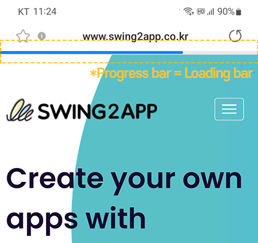

# Progress Bar Color Settings

***

## 1.What is a Progress Bar?

<figure><figcaption></figcaption></figure>

A progress bar is a progress indicator displayed at the top of the mobile web.&#x20;

It is a horizontally long bar that visually shows how much of a task has been completed.&#x20;

You can think of it as similar in meaning to 'loading'.&#x20;

The progress bar can be seen in web apps connected to mobile websites - WebView, and in push apps.

***

## 2.Usage Method

Moving to App Creation V3 Screen \*The progress bar is available in App Creation V3 version, and can be used by switching to V3 if currently using V2.

<figure><figcaption></figcaption></figure>

1. Maker(V3)
2. Select 'Advanced Settings'
3. Setting: Choose 'App Creation Settings'
4. Select the \[EDIT] button for 'Progress Bar Color'
5. Choose the desired color by selecting a setting value and then click the \[APPLY] button If you have an exact color value, please enter it as a HEX color code (color code) with '#'.
6. Select the \[Save] button at the top
7. Select the \[App Update] button&#x20;

\*If the app has not been created yet, it will show as the \[Create App] button.&#x20;

\*You need to update the app to reflect the set color in the app."

***

## 3.App Screen)Changing the Color of the Progress Bar

<figure><figcaption></figcaption></figure>

Default setting color of the progress bar: #0C99F8&#x20;

\*If you do not change the color separately, the progress bar is provided with the above color as the default setting.&#x20;

After changing to the desired color, when you create (update) a new version of the app, you can see that the progress bar is applied in the changed color.&#x20;

If you have a main color for the website or a desired color, you can use it by setting the color value in the progress bar color settings.

***

## 4.Guidelines

1\)The progress bar color setting feature is an addition to version V3 and is not available in version V2.

To use this feature, you need to switch to V3. When switching, you must perform the initial update.

2\)The progress bar color setting feature requires an app update.&#x20;

If you change the color, please select the \[App Update] button to recreate the app as a new version.

For the initial app creation, please select the \[Create App] button.

3\)The progress bar color setting feature is available in web apps connected to websites – WebView, and in push apps.

4\)You can also remove the progress bar.&#x20;

If you want to modify it to not be displayed in the app, please check the guide below.



