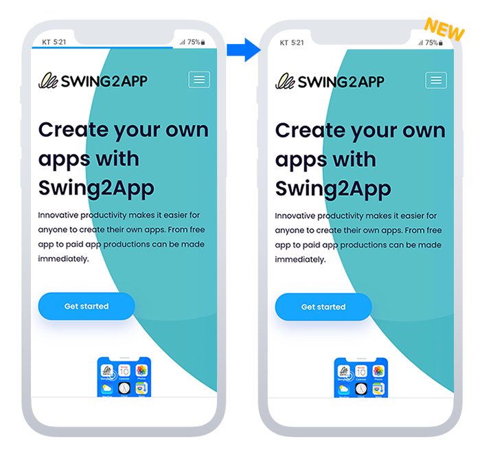
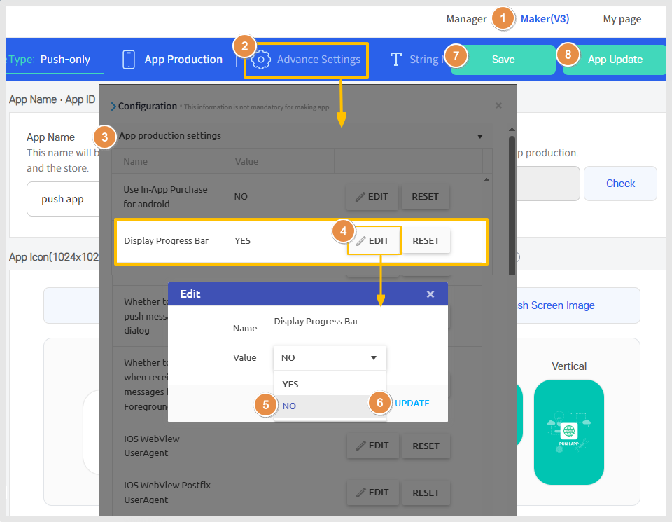

# Remove progress bar (not in use)

***

## 1. Not display the progress bar

<figure><figcaption></figcaption></figure>

An option has been added to allow users to set whether the progress bar is displayed in the web app.&#x20;

If you do not want it to be shown, you can disable its use in the advanced settings, making it invisible in the app.&#x20;

With the addition of the progress bar removal feature, checking 'Not in Use' will make it not visible.

### <mark style="color:blue;">What is a Progress Bar?</mark>

<figure><figcaption></figcaption></figure>

A progress bar is a progress indicator displayed at the top of the mobile web.&#x20;

It is a horizontally long bar that visually shows how much of a task has been completed.&#x20;

You can think of it as similar in meaning to 'loading'.&#x20;

The progress bar can be seen in web apps connected to mobile websites - WebView, and in push apps.

#### <mark style="color:orange;">**\*When using the progress bar, it is possible to change its color.**</mark>&#x20;

Please refer to the help guide for the method of changing the color.

***

## 2. Usage Method

<figure><figcaption></figcaption></figure>

1. Maker(V3)
2. Select 'Advanced Settings'.
3. Choose 'App Production Settings' in settings.
4. Select the \[EDIT] button in the 'Display Progress Bar' section.
5. Set the value to 'NO' \*The default setting is 'YES'.
6. Select \[UPDATE]
7. \[Save]
8. Select the \[App Update] button

\*Changes can be confirmed after updating the app to a new version.&#x20;

\*If your app has been released on the Play Store, App Store, etc., you must submit an update with the new version.

***

## 3.Guidelines

1\)This feature applies only when using web apps - push apps, WebView apps.&#x20;

It does not apply to regular prototype creation apps.

2\)The progress bar setting feature is only available in version V3, and cannot be used in version V2.&#x20;

To use this feature, you need to switch to V3.&#x20;

When switching, you must perform the initial update.

3\)An app update is required.&#x20;

As of January 4, 2024, the updated feature is automatically applied for those who created new apps.

Those who created apps before January 3, 2024, must update the app after setting it up using the above method.&#x20;

Apps released on stores (App Store, Play Store) must be resubmitted as an updated version

