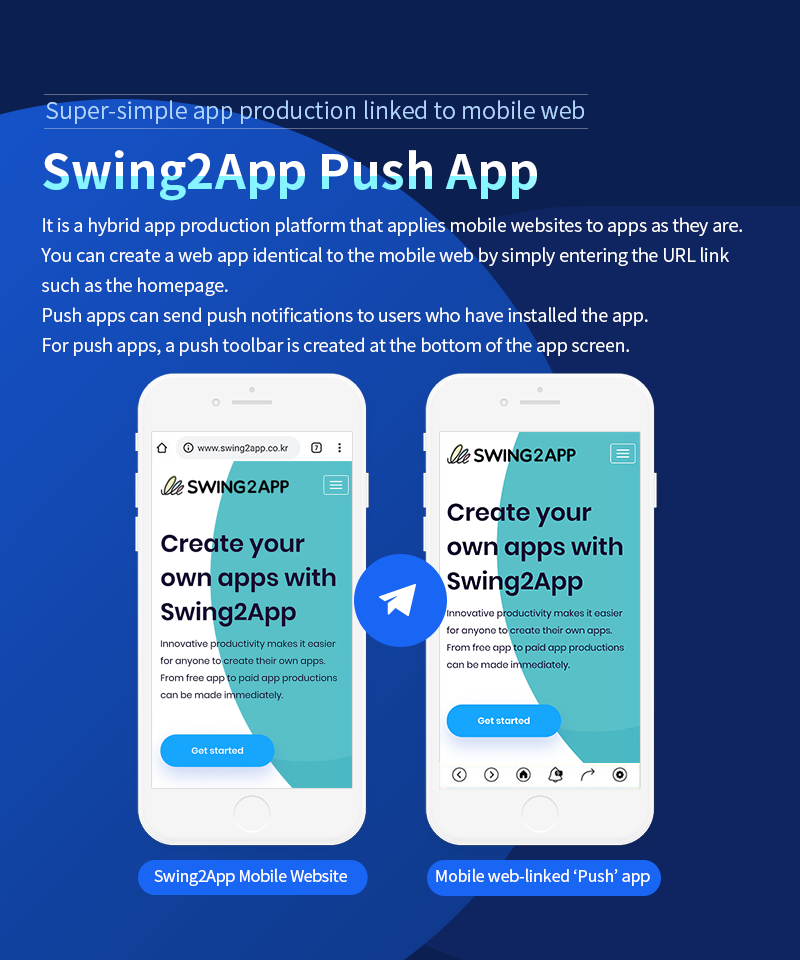
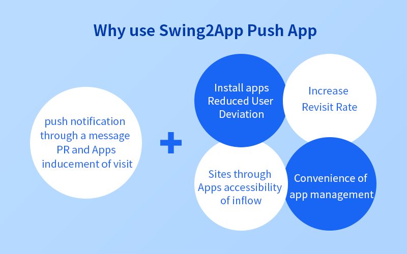
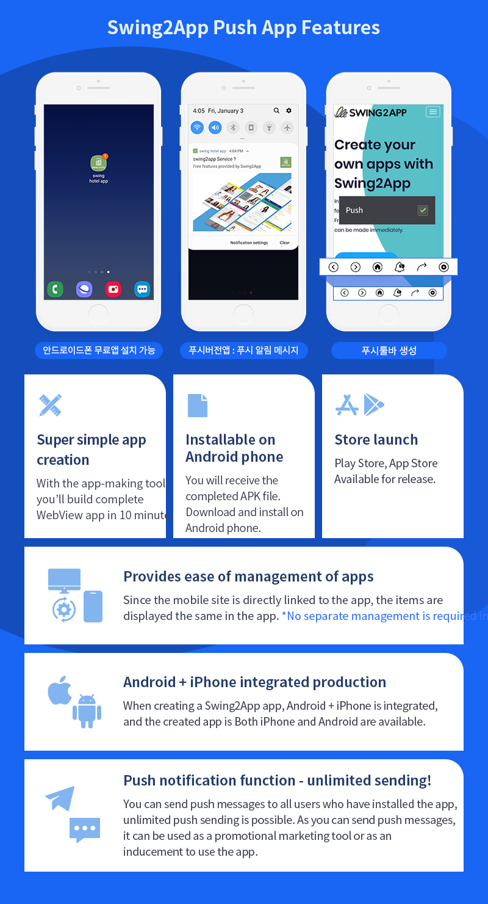
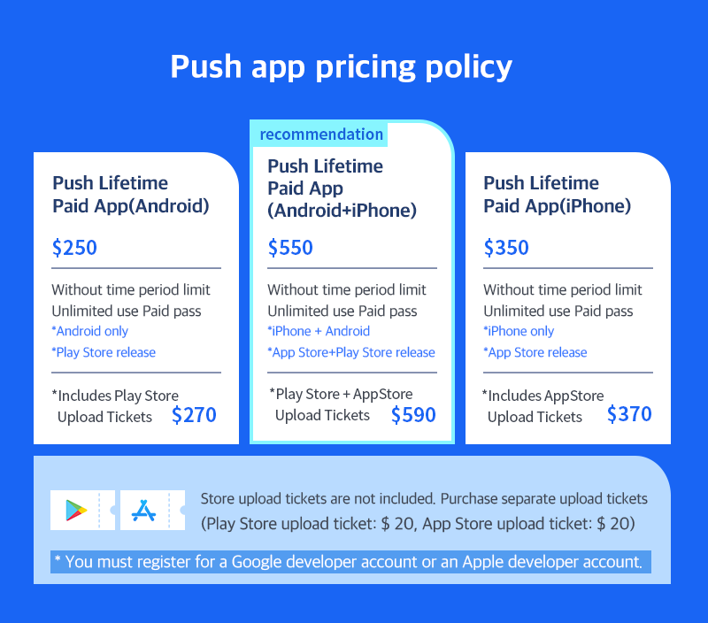

# Swing2App Push App

***

## Introduction to Push App&#x20;

<figure><figcaption></figcaption></figure>

## Reasons for Using Push App

<figure><figcaption></figcaption></figure>

## Features of Push App&#x20;

<figure><figcaption></figcaption></figure>

## How to Create a Push App&#x20;

<figure><figcaption></figcaption></figure>

## Pricing Policy for Push App

<figure><figcaption></figcaption></figure>

If you want to see the entire process of creating and launching a Push app in the store at a glance?&#x20;

You can check more details about the Swing2App Push app creation method in the manual below.

Manual for the Entire Process of Push App

