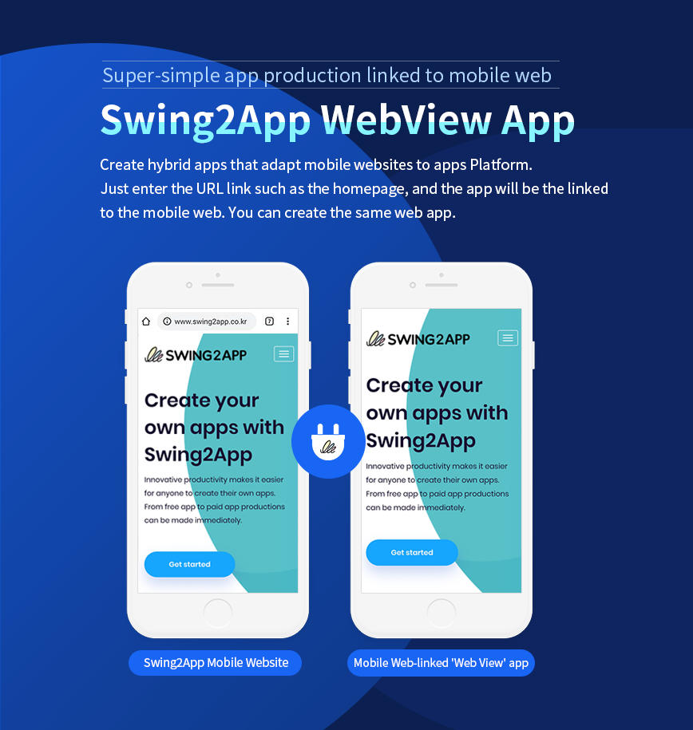
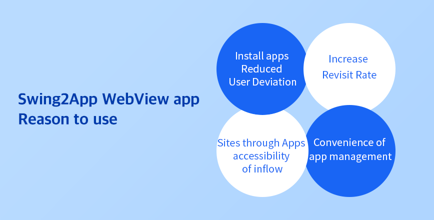
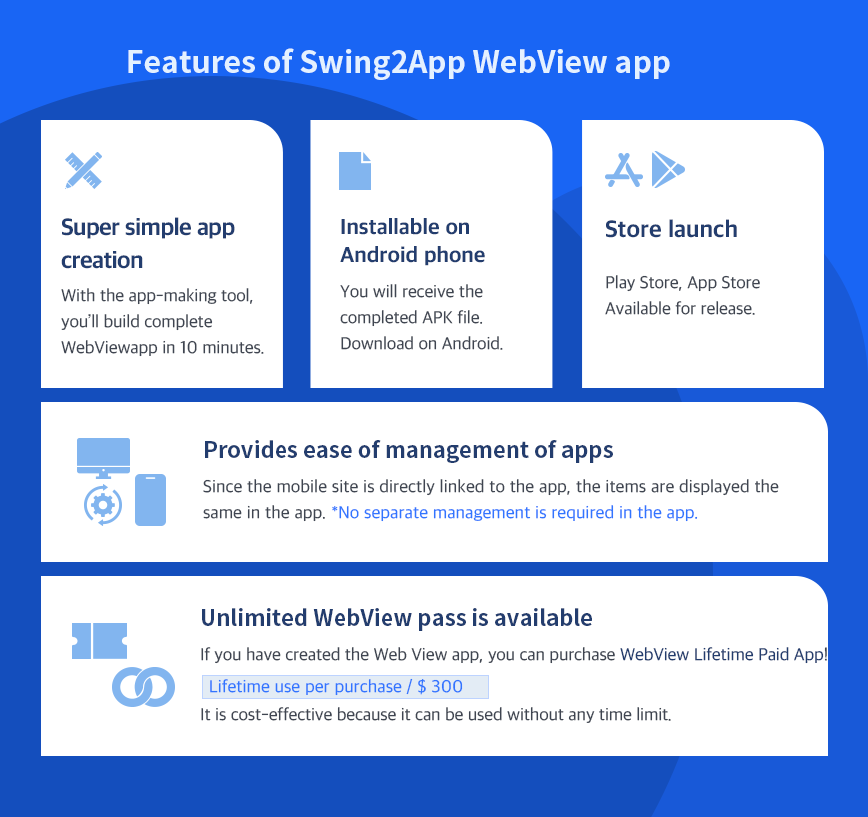
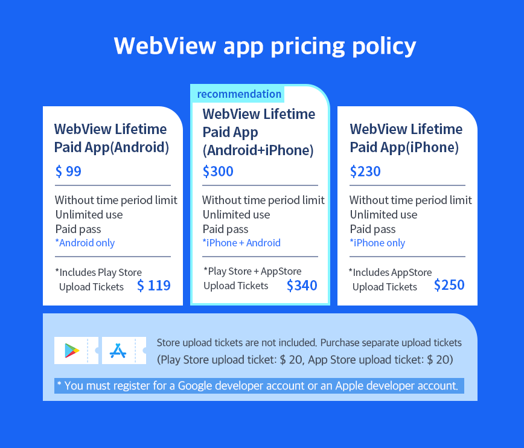

# Swing2App WebView App

***

## Introduction to WebView App&#x20;

<figure><figcaption></figcaption></figure>

## Reasons for Using WebView App

<figure><figcaption></figcaption></figure>

## Features of WebView App&#x20;

<figure><figcaption></figcaption></figure>

## How to Create a WebView App&#x20;

<figure><figcaption></figcaption></figure>

## Pricing Policy for WebView App

<figure><figcaption></figcaption></figure>

If you want to see the entire process of creating and launching a WebView app in the store at a glance

You can check more details about the Swing2App WebView app creation method in the manual below.



